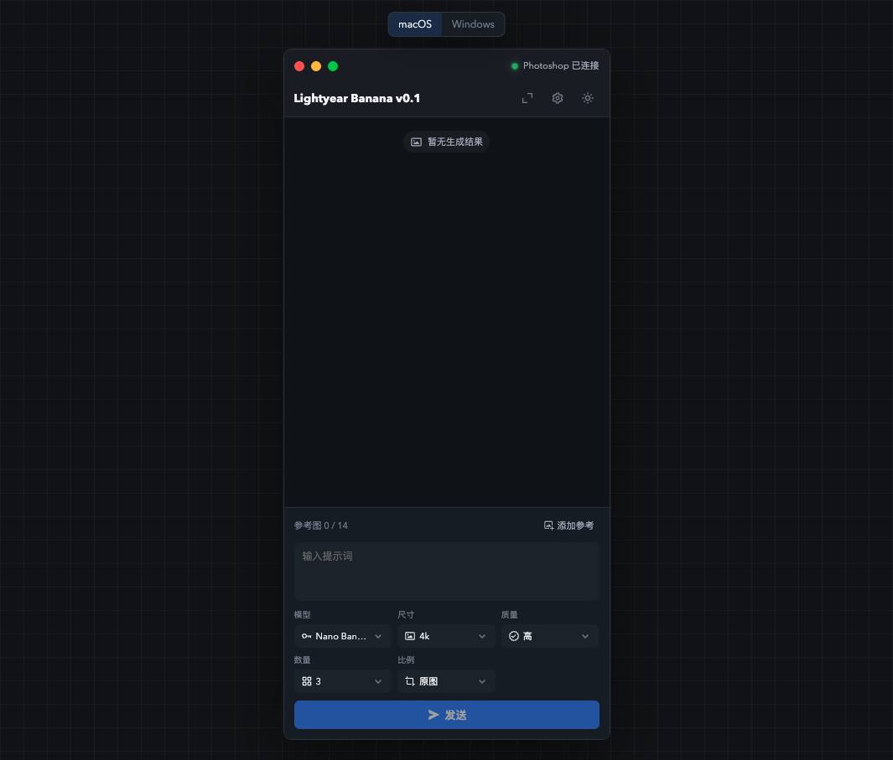
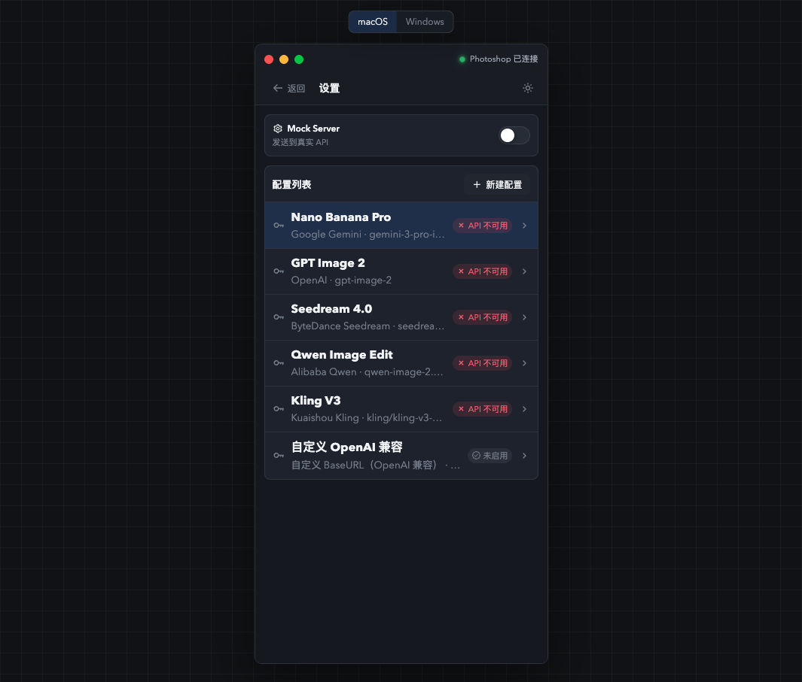
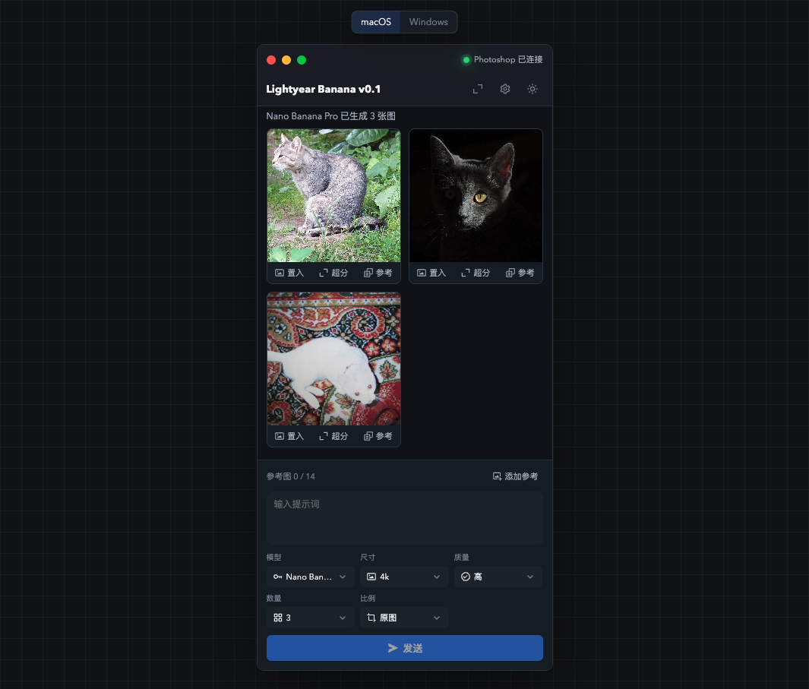

# Lightyear Banana

在 Photoshop 里连接 AI 生图模型。你可以把当前画布、选区和图层作为参考图，生成新图片后直接置入 Photoshop 文档。



## 安装

Lightyear Banana 由桌面本体和 Photoshop CCX 插件一起工作。桌面本体负责模型配置、生成任务、结果流和窗口部署；CCX 插件负责连接 Photoshop，读取画布、选区和图层，并把结果写回文档。

同一版本需要下载 2 个文件：

- macOS 用户：`lightyear-banana-0.1.0-mac.zip` 和 `lightyear-banana-0.1.0.ccx`
- Windows 用户：`lightyear-banana-0.1.0-win.zip` 和 `lightyear-banana-0.1.0.ccx`

### 1. 安装桌面本体

macOS：

1. 解压 `lightyear-banana-0.1.0-mac.zip`。
2. 把 `Lightyear Banana.app` 拖到“应用程序”文件夹。
3. 打开 `Lightyear Banana.app`。

Windows：

1. 解压 `lightyear-banana-0.1.0-win.zip`。
2. 打开解压后的文件夹。
3. 运行 `Lightyear Banana.exe`。

启动后会打开 Lightyear App。本地工作台默认运行在 `127.0.0.1:38321`，桌面窗口会自动连接这个本地服务。

### 2. 安装 Photoshop CCX 插件

推荐使用 Adobe Creative Cloud 桌面端安装：

1. 打开 Adobe Creative Cloud 桌面端。
2. 把 `lightyear-banana-0.1.0.ccx` 拖进 Creative Cloud 窗口。
3. 按照弹窗完成安装。
4. 重启 Photoshop，或在 Photoshop 中重新打开插件菜单。

开发调试时也可以用 UXP Developer Tools 加载：

1. 运行 `npm run verify:uxp`。
2. 在 UXP Developer Tools 中选择 `dist/ps-uxp/manifest.json`。
3. 点击 Load。
4. 改过 `plugin/manifest.json` 后，先 Unload，再 Load。

## 打开面板

1. 打开 Lightyear App。
2. 打开 Photoshop 2026。
3. 打开或新建一个 Photoshop 文档。
4. 在 Photoshop 菜单中选择“增效工具 > Lightyear Banana”。
5. 面板顶部显示“Photoshop 已连接”后即可使用。

如果顶部显示“Photoshop 未连接”，先确认 Lightyear App 已打开，再重新打开 Photoshop 面板。

## 配置模型

点击右上角设置按钮进入配置页。



你可以直接编辑默认配置，也可以点击“新建配置”添加自己的模型。云端模型需要填写对应服务的 API Key。Codex Image Server 只需要填写 Base URL。

当前内置配置：

- Nano Banana Pro：Google Gemini
- GPT Image 2：OpenAI
- Seedream 4.0：ByteDance Seedream
- Qwen Image Edit：Alibaba Qwen
- Kling V3：Kuaishou Kling
- Codex Image Server：本机 Codex
- 自定义 OpenAI 兼容

保存配置后，回到工作台，在底部“模型”菜单中选择要使用的配置。

## 生成图片

1. 在 Photoshop 文档中准备好画布、选区或图层。
2. 在 Lightyear Banana 面板底部点击“添加参考”。
3. 选择“可见图层”“选区”或“当前选中图层”。
4. 输入提示词。
5. 选择模型、尺寸、质量、数量和比例。
6. 点击“发送”。
7. 等待结果出现在对话流中。



结果图下方有 3 个常用动作：

- “置入”：把结果放回 Photoshop，可选择全画布、当前选区或参考图选区。
- “超分”：把这张结果图放入下一轮，并自动填入高分辨率参数。
- “参考”：把这张结果图加入当前参考图列表。

## 窗口部署

Lightyear App 顶部有窗口部署按钮，可以把工作台固定在屏幕左侧或右侧，并尝试同步调整 Photoshop 窗口。

macOS 第一次使用窗口部署时，可能需要在系统设置中允许以下权限：

- 辅助功能
- 自动化
- 屏幕录制

设置页顶部提供了对应入口。授权后重新点击窗口部署即可。

## 系统要求

- macOS 14 及以上，或 Windows 10 及以上
- Photoshop 2026，版本 27.3.0 及以上
- Adobe Creative Cloud 桌面端，或 UXP Developer Tools
- 本地端口 `38321` 用于 Lightyear App 和 Photoshop 插件通信

## 常见问题

### Lightyear App 已打开，但 Photoshop 仍显示未连接

先关闭 Photoshop 面板，再从“增效工具 > Lightyear Banana”重新打开。仍未连接时，确认桌面本体没有被系统防火墙拦截，并检查本地端口 `38321` 是否被占用。

### 设置页里显示 API 不可用

云端配置先检查 API Key 是否填写完整。Codex Image Server 和自定义 OpenAI 兼容模型还要确认 Base URL 可以访问。

### CCX 安装后菜单里没有 Lightyear Banana

重启 Photoshop。仍未出现时，重新把 `.ccx` 拖入 Adobe Creative Cloud 安装，或用 UXP Developer Tools 加载 `dist/ps-uxp/manifest.json` 检查插件是否能启动。

### 置入 Photoshop 失败

确认当前 Photoshop 文档仍然打开。选择“当前选区”置入时，需要先在 Photoshop 里建立有效选区。

## 开发命令

```bash
npm install
npm run dev
npm run dev:electron
npm run build:uxp
npm run verify:uxp
npm run package:uxp
npm run package:electron:mac
npm run package:electron:win
```

常用产物：

- `dist/lightyear-banana-0.1.0.ccx`
- `dist/lightyear-banana-0.1.0-mac.zip`
- `dist/lightyear-banana-0.1.0-win.zip`
- `dist/release-0.1.0/`

修改 Vue、TypeScript、CSS 后运行 `npm run build:uxp`。完成 UXP 相关改动后至少运行 `npm run verify:uxp`。修改 manifest、entrypoint、icon 或权限后，在 UXP Developer Tools 中执行 Unload，再重新 Load。
