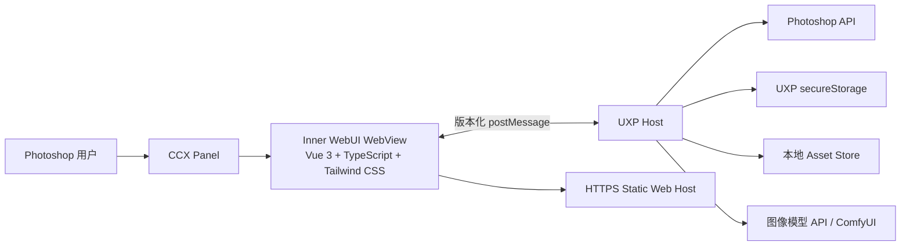
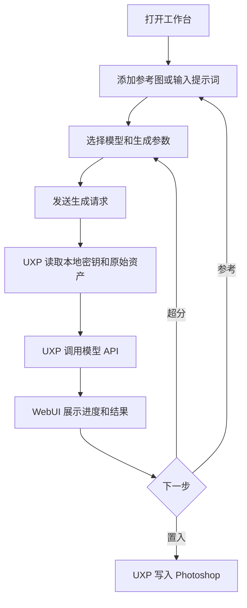

# Mugen Inner WebUI 产品需求与工程迁移规格

| 属性 | 值 |
| --- | --- |
| 状态 | 待评审 |
| 文档版本 | 1.0 |
| 日期 | 2026-08-07 |
| 适用范围 | Electron 工作台迁移、Photoshop CCX WebView、WebUI 持续发布 |

## 1. 文档目的

本文定义 Mugen 从“Electron UI + 本地 HTTP Bridge + CCX”迁移到“CCX WebView + 线上 Inner WebUI”的目标产品、功能规格、工程结构、宿主协议、数据边界和上线门禁。

本文供产品、前端、UXP、服务端、测试和发布人员共同使用。迁移完成前，现有 Electron 架构仍是线上行为基线；迁移通过本文的功能等价门禁后，Electron 才进入废弃流程。

## 2. 背景

当前产品由两个安装产物组成：

- Electron 桌面 App 承载完整 Vue 工作台、本地系统能力、设置持久化和本地 Bridge。
- CCX 插件运行在 Photoshop UXP 中，通过本地 HTTP 长轮询接收 Electron 指令，并执行画布读取和结果写入。

这套结构已经跑通完整工作流，但带来以下成本：

- 每次桌面能力变更都需要分别构建和验证 macOS、Windows 包。
- 用户需要同时安装桌面 App 和 CCX。
- Electron 与 CCX 之间存在端口、鉴权、断线重连和日志维护成本。
- Vue 工作台与 UXP Adapter 分属两个进程，大图数据需要跨本地 Bridge 传输。
- Electron 发布门禁要求当前平台打包，并需要跨平台产物协调。

UXP WebView 可以在 CCX Panel 中加载完整网页，并通过 `postMessage` 与 UXP 插件通信。迁移后，用户只安装 CCX，工作台从 HTTPS 地址加载。常规 UI 更新通过 Web Host 发布；Photoshop 能力、权限或宿主协议变化时才发布新 CCX。

## 3. 产品决策

### 3.1 目标形态



目标架构遵循以下决策：

1. CCX 是唯一必装客户端。
2. CCX Panel 使用 WebView 加载线上 Vue WebUI。
3. WebUI 负责界面、交互状态和产品流程编排。
4. UXP Host 负责 Photoshop API、BYOK 密钥、安全存储、本地文件、剪贴板、原始图像资产和模型请求。
5. WebUI 与 UXP Host 只通过版本化消息协议通信。
6. 原始 RGBA、完整参考图和完整生成图不通过普通消息长期传输。
7. Electron 在功能等价门禁完成后停止发布。

### 3.2 Inner WebUI 定义

本文中的 Inner WebUI 指运行在 Photoshop CCX WebView 内的完整工作台。它也可以在普通浏览器中以 Mock Host 模式独立运行，用于前端开发和自动化测试。

Inner WebUI 使用：

- Vue 3
- TypeScript strict mode
- Composition API 和 `<script setup lang="ts">`
- Vite
- Tailwind CSS 4，使用 `@tailwindcss/vite`
- Vue Router，使用 hash history
- Pinia
- Vitest
- Playwright，用于普通浏览器端到端测试

生产构建不得从 CDN 动态加载 Vue、Tailwind 或其他运行时代码。所有依赖必须锁定在 lockfile 中并输出静态哈希资源。

### 3.3 Web Host 边界

Web Host 至少提供静态资源托管：

- `index.html`
- 带内容哈希的 JavaScript 和 CSS
- 字体、图标和图片资源
- 版本与兼容性描述文件

BYOK 首版不要求账号系统。模型 API Key 不上传到 Web Host。若后续增加账户同步、遥测或服务端代理，需要另立需求并完成隐私评审。

### 3.4 发布边界

| 变更 | WebUI 发布 | CCX 发布 |
| --- | --- | --- |
| 文案、样式、布局、普通交互 | 必须 | 不需要 |
| WebUI 内部状态和非破坏性流程 | 必须 | 不需要 |
| 协议 v1 内新增可选字段 | 必须 | 视宿主能力而定 |
| 新增 Photoshop 命令 | 必须 | 必须 |
| 修改 manifest 权限或 WebView 域名 | 可能 | 必须 |
| 修改 secureStorage、Asset Store 或 Provider Runtime | 可能 | 必须 |
| 协议破坏性升级 | 必须 | 必须 |

## 4. 目标与非目标

### 4.1 产品目标

- 用户只安装一个 CCX，即可使用完整 Mugen 工作台。
- 工作台功能达到当前 Electron UI 的核心功能等价。
- 常规 UI 发布不再依赖 macOS、Windows Electron 打包。
- Photoshop 画布读取和写入留在本地 UXP Runtime。
- BYOK API Key 加密保存在 UXP `secureStorage`。
- WebUI 线上版本与已安装 CCX 保持可判断、可回退的协议兼容性。
- Windows 和 macOS Photoshop 中提供一致的核心流程。

### 4.2 工程目标

- WebUI 不导入 Electron、Node 或 Photoshop 模块。
- UXP Host 不承载完整产品 UI。
- 产品领域类型与宿主消息协议拥有独立包和自动化测试。
- Provider Adapter 可以在 UXP Runtime 中执行，并通过注入的 `fetch`、存储和资产接口测试。
- WebUI 可以连接 Mock Host，在普通浏览器完成大部分开发和回归。

### 4.3 非目标

- 首版不提供独立桌面窗口和系统级窗口部署。
- 首版不提供 Electron 内置 Codex Image Server 进程。
- 首版不自动迁移旧 Electron 中保存的 API Key。
- 首版不把完整 Photoshop 原图、提示词或 API Key 同步到 Mugen 自有服务器。
- 首版不支持在普通浏览器中直接操作 Photoshop。
- 首版不引入账号、订阅、云端历史同步和多人协作。

## 5. 用户体验总览

### 5.1 启动流程

1. 用户在 Photoshop 中打开 Mugen Panel。
2. CCX 渲染最小原生启动壳，并创建 WebView。
3. WebView 加载固定的 HTTPS WebUI v1 地址。
4. WebUI 发送 `host.handshake`。
5. UXP Host 返回协议版本、插件版本、Photoshop 版本、平台、主题、文档状态和能力声明。
6. 协议兼容时进入工作台；不兼容时显示更新提示。
7. WebUI 加载失败时，原生启动壳提供重试，并显示可读错误。

启动壳用户文案：

| 状态 | 文案 | 操作 |
| --- | --- | --- |
| 加载中 | `正在打开 Mugen` | 无 |
| 网络不可用 | `无法加载工作台，请检查网络后重试` | `重试` |
| 协议不兼容 | `Mugen 插件需要更新` | `查看更新` |
| Web Host 故障 | `工作台暂时不可用，请稍后重试` | `重试` |

### 5.2 主流程



## 6. 功能等价范围

### 6.1 Electron UI 对标矩阵

| 编号 | 当前 Electron 能力 | Inner WebUI 目标 | 负责模块 | 迁移结论 |
| --- | --- | --- | --- | --- |
| F-01 | 工作台、设置页和配置详情导航 | 保持页面与返回逻辑 | WebUI | 保留 |
| F-02 | 深色、浅色主题 | 支持用户选择并跟随 Photoshop 初始主题 | WebUI + Host | 保留 |
| F-03 | Photoshop 连接和文档状态 | Panel 内默认宿主在线，展示当前文档状态 | Host | 改写 |
| F-04 | 抓取可见图层 | 创建本地资产并返回缩略图和尺寸 | Host | 保留 |
| F-05 | 抓取选区 | 保存 `sourceBounds`，返回合成选区预览 | Host | 保留 |
| F-06 | 抓取当前图层 | 创建本地资产并返回缩略图和尺寸 | Host | 保留 |
| F-07 | 上传参考图 | 使用 UXP 文件选择器和本地图片解码 | Host | 改写 |
| F-08 | 读取剪贴板图片 | 使用经过实机验证的 UXP 剪贴板能力 | Host | 改写 |
| F-09 | 参考图上限、删除和清空 | 根据当前模型能力实时限制 | WebUI | 保留 |
| F-10 | 提示词、Enter 发送、Shift+Enter 换行 | 保持输入法组合态和禁用规则 | WebUI | 保留 |
| F-11 | 模型、尺寸、质量、数量、比例 | 保持 Provider Capability 驱动 | WebUI + Shared Domain | 保留 |
| F-12 | 自定义宽高 | 支持预设和自定义分辨率切换 | WebUI | 保留 |
| F-13 | 多 Provider 生图 | UXP Provider Runtime 执行请求 | Host + Shared Provider | 改写 |
| F-14 | 生成计时、阶段、请求日志 | 使用宿主事件流更新 | WebUI + Host | 保留 |
| F-15 | 取消、重试、追加、编辑请求 | 使用稳定请求快照执行 | WebUI + Host | 保留 |
| F-16 | 多轮对话和多结果卡片 | 保持当前消息流体验 | WebUI | 保留 |
| F-17 | 图片预览 | 使用 WebUI 模态预览 | WebUI | 替代原生预览窗口 |
| F-18 | 保存生成图片 | 使用 UXP 保存选择器 | Host | 改写 |
| F-19 | 置入原始尺寸、全画布、当前选区、参考选区 | 使用 Asset ID 定位本地原图并写入 | Host | 保留并补齐 |
| F-20 | 结果作为参考图 | 复用本地 Asset ID | WebUI + Host | 保留 |
| F-21 | 超分参数填充 | 保持当前参数回填逻辑 | WebUI | 保留 |
| F-22 | 配置列表、新建、复制、启停、删除 | 保持现有流程 | WebUI + Host Storage | 保留 |
| F-23 | Provider、模型、Base URL、API 格式 | 保持现有字段和能力摘要 | WebUI | 保留 |
| F-24 | ComfyUI Workflow 和节点映射 | 保持配置、测试、轮询和超时 | WebUI + Host | 保留 |
| F-25 | API Key 编辑和配置测试 | Key 写入 secureStorage；测试由 Host 执行 | WebUI + Host | 安全改写 |
| F-26 | 对话记录清理 | 清除 WebUI 历史和 Host 资产索引 | WebUI + Host | 保留 |
| F-27 | 诊断日志导出 | 导出脱敏后的 WebView、Host、Photoshop 操作日志 | Host | 改写 |
| F-28 | CRX 连接日志 | 改为 WebView Bridge 日志 | Host | 替代 |
| F-29 | App 更新检查 | 展示 CCX 与 WebUI 版本；CCX 更新走正式发布页 | WebUI + Host | 改写 |
| F-30 | Electron 窗口左右部署 | Panel 由 Photoshop 管理 | 无 | 下线 |
| F-31 | macOS 辅助功能、自动化、录屏入口 | 不再需要窗口部署权限 | 无 | 下线 |
| F-32 | Electron 本地 Bridge 和端口状态 | WebView 直连 Host，无端口状态 | 无 | 下线 |
| F-33 | Electron 内置 Codex Image Server | 改为外部 HTTPS 或用户自行运行的服务地址 | 外部服务 | 拆分 |
| F-34 | Electron 提供 CCX 下载入口 | 用户已经运行在 CCX 内，不再提供安装入口 | 无 | 下线 |

### 6.2 功能优先级

| 优先级 | 范围 | 上线要求 |
| --- | --- | --- |
| P0 | 启动、握手、工作台、参考图、生成、结果展示、置入、BYOK 配置 | Electron 废弃前必须完成 |
| P1 | 上传、剪贴板、保存、重试、追加、编辑、超分、请求日志、诊断导出、ComfyUI | 正式切换前必须完成 |
| P2 | WebUI 灰度、更新提示、历史迁移工具、可观测性增强 | 可随灰度阶段完成 |
| P3 | 账户同步、云端历史、服务端代理、独立浏览器产品 | 不属于本次迁移 |

## 7. 详细功能规格

### IW-FR-001 WebView 启动与握手

WebUI 必须在收到成功握手前保持只读启动状态。

验收标准：

- WebUI 启动后只接受来自当前 WebView Host 的消息。
- WebUI 发送自身 `webVersion`、`protocolVersion` 和随机 `clientNonce`。
- Host 返回 `hostVersion`、支持的协议范围、平台、Photoshop 版本、UXP 版本、主题、当前文档和能力列表。
- WebUI 与 Host 必须同时确认 `clientNonce` 和 `sessionId`。
- 协议不兼容时不展示工作台操作入口。
- WebView 重新加载后创建新会话，旧会话中的响应必须被忽略。
- 普通浏览器打开 WebUI 时自动进入 Mock Host，页面显式显示 `预览模式`。

### IW-FR-002 页面结构与响应式布局

WebUI 保持当前顶部栏、结果流、输入 Dock、设置列表和配置详情的信息架构。

验收标准：

- 最小宽度按 280px 验证。
- 顶部栏固定在上方，输入 Dock 固定在下方，结果流内部滚动。
- 停靠面板和浮动面板均不得出现整页横向滚动。
- 主题支持 `dark`、`light` 和 `system`。
- `system` 初始值来自 Host；用户选择保存在 WebUI 偏好设置中。
- 面板尺寸变化后不丢失正在输入的提示词、参考图或配置草稿。
- Windows WebView 与 macOS WebView 分别完成键盘、聚焦、滚动和弹层回归。

### IW-FR-003 Photoshop 状态

WebUI 顶部显示当前宿主和文档状态。

状态包括：

- Photoshop 已就绪。
- 当前没有打开文档。
- 当前文档名称。
- Photoshop 操作进行中。
- WebView Bridge 暂不可用。

Host 在文档切换、关闭、重命名或能力变化时发送 `host.contextChanged`。WebUI 不通过轮询本地端口判断连接。

### IW-FR-004 参考图管理

参考图来源包括：

| 来源 | Host 行为 | WebUI 行为 |
| --- | --- | --- |
| 可见图层 | 抓取当前文档可见合成图 | 显示缩略图、尺寸和来源 |
| 选区 | 抓取选区内可见合成图并保存 bounds | 显示缩略图、尺寸和选区标识 |
| 当前选中图层 | 抓取 active layer 像素 | 显示缩略图、尺寸和来源 |
| 上传文件 | 打开 UXP 文件选择器、校验和解码 | 显示缩略图和文件名 |
| 剪贴板 | 读取图片并校验 | 显示缩略图和来源 |
| 生成结果 | 复用已有 Asset ID | 显示生成结果缩略图 |

验收标准：

- WebUI 只保存 `HostAssetRef`，不持有原始 RGBA。
- 当前数量达到模型上限时禁用所有新增入口。
- 用户可以删除单张参考图和清空全部参考图。
- 取消文件选择不显示错误。
- 不支持的文件格式、超过限制、无选区、无 active layer 和无文档均显示可恢复错误。
- 选区参考图保留发送时的 `sourceBounds`，后续文档选区变化不影响该记录。
- WebView 重载后，失效 Asset ID 必须显示为不可用，不能静默使用空图。

### IW-FR-005 提示词与生成参数

验收标准：

- 提示词或参考图至少存在一项时允许发送。
- 只有参考图时使用默认提示词 `根据参考图生成`。
- Enter 发送，Shift + Enter 换行，输入法组合态不发送。
- 生成任务进行中仍允许编辑下一条输入，但同一草稿不能重复提交。
- 模型选择器只显示启用且配置完整的配置。
- 尺寸、质量、数量和比例由当前 Provider Capability 决定。
- 支持预设分辨率和自定义宽高。
- 自定义宽高必须为整数，并遵守当前 Provider 的范围与步进约束。
- `原图比例`、`参考图比例`、`画布比例`按照当前 Provider 规则解析。
- 发送时创建不可变 `GenerationRequestSnapshot`，后续配置修改不能改变已发送任务。

### IW-FR-006 生成任务

WebUI 发送 `generation.start`，Host 读取密钥、资产和 Provider 配置后执行模型请求。

验收标准：

- API Key 不包含在普通生成消息中。
- Host 根据 `configId` 从 secureStorage 读取密钥。
- Host 发出等待、上传、请求、轮询、下载、重试、完成和失败阶段事件。
- WebUI 显示秒级耗时和当前阶段。
- 支持用户取消；Host 必须中止可中止的网络请求和轮询。
- 自动重试必须遵守当前 Provider 策略，并显示重试状态。
- 请求日志只包含脱敏 URL、方法、状态、响应大小、阶段耗时和非敏感元数据。
- 错误结果作为一轮记录保留，并提供编辑和重试入口。
- Provider 未返回图片时显示 `API 未返回图片`。
- 网络不可用时显示 `无法连接 API`。

### IW-FR-007 Provider 范围

Inner WebUI 必须对齐当前 `providerCapabilities` 中的配置能力：

- OpenAI
- i-mini
- Google Gemini
- APIMart
- ByteDance Seedream
- Alibaba Qwen
- Kuaishou Kling
- Black Forest Labs
- 本地 ComfyUI
- Codex Image Server 外部服务
- 自定义 OpenAI Images、OpenAI Chat 和 Gemini 格式

验收标准：

- Provider 名称、模型、参考图上限、尺寸、质量、数量和比例由共享能力声明生成。
- Provider Adapter 不在 Vue 组件内拼装请求。
- Provider Adapter 通过统一接口读取参考资产、发起请求、轮询任务和输出 `GeneratedAssetRef[]`。
- 自定义 Base URL 必须经过 URL 校验，只允许 `http` 或 `https`。
- 生产 CCX 的网络权限策略必须覆盖所有内置 Provider。
- `http://127.0.0.1` 和 `http://localhost` 仅用于明确支持的本地服务。
- Codex Image Server 不再由 CCX 启动。配置页需要说明外部服务状态，并允许编辑 Base URL。

### IW-FR-008 结果流

每轮生成记录包含：

- 提示词
- 已发送参考图
- 请求参数摘要
- Provider 和模型
- 耗时
- 请求日志
- 结果图片列表
- 正常、错误或取消状态

验收标准：

- 新任务和新结果出现后自动滚动到最新内容；用户主动向上浏览时不强制抢回滚动位置。
- 每张结果支持预览、保存、置入、超分和添加参考。
- 失败任务支持编辑和重试。
- 成功任务支持按原参数追加生成。
- 图片加载失败时保留操作区并提供重试加载。
- 清除对话记录需要二次确认，并同时释放不再引用的 Host 资产。
- 重启 Photoshop 或重新打开 Panel 后，已持久化的历史结果仍可预览、保存、置入和添加参考。

### IW-FR-009 结果置入 Photoshop

置入目标包括：

- 默认目标
- 原始尺寸
- 全画布
- 当前选区
- 本轮任一选区参考图的位置

验收标准：

- WebUI 发送 `assetId` 和结构化目标，不发送 batchPlay descriptor。
- Host 在执行前验证文档、目标 bounds 和资产状态。
- 修改文档的操作必须进入 `core.executeAsModal()`。
- Host 创建新像素图层并调用 `imaging.putPixels()`。
- 原始图片按目标区域缩放，保留明确的比例和裁切策略。
- 用户切换文档后，旧文档捕获的选区目标必须被识别并提示确认或禁止置入。
- 成功后 WebUI 显示置入位置和图层结果。
- 失败后保留结果卡片和重试入口。

### IW-FR-010 预览与保存

验收标准：

- 图片预览在 WebUI 模态层中完成，不创建独立桌面窗口。
- 预览支持适应窗口、原始比例、关闭和保存。
- 保存操作调用 Host 文件选择器。
- Host 根据图片真实 MIME 类型提供扩展名，并校验保存结果。
- 保存取消不显示错误。
- WebUI 不依赖浏览器 `<a download>` 完成正式保存。

### IW-FR-011 模型配置

配置列表和详情保持当前 Electron UI 的字段与操作：

- 配置名称
- 启用状态
- Provider
- 模型列表与当前模型
- API 格式
- Base URL
- API Key
- ComfyUI Workflow JSON
- ComfyUI 节点映射
- 超时和轮询间隔
- 能力摘要

验收标准：

- 支持新建、保存、复制、启停和删除。
- 至少保留一个配置。
- 关闭当前配置后自动选择下一个可用配置。
- API Key 输入框默认为空，并显示是否已保存凭据。
- WebUI 不读取或回显完整 API Key。
- 保存新 Key 时通过专用命令写入 secureStorage。
- 删除配置时同时删除对应 secureStorage 项。
- 修改非密钥字段时不需要重新提交 Key。
- 配置测试由 Host 执行，并返回统一状态和脱敏错误。

### IW-FR-012 BYOK 和本地数据

数据按敏感度分层保存：

| 数据 | 存储位置 | 规则 |
| --- | --- | --- |
| API Key、访问 Token | UXP `secureStorage` | 加密保存，只通过专用命令写入和删除 |
| Provider 配置元数据 | UXP plugin data | JSON schema 版本化，不包含 Key |
| 当前激活配置 | UXP plugin data | 与配置元数据一起保存 |
| 主题、布局、最近页面 | WebView `localStorage` | 只保存非敏感偏好 |
| 提示词草稿 | WebView `sessionStorage` | 面板会话结束后可丢失 |
| 对话历史元数据 | UXP plugin data | schema 版本化；不保存原始 RGBA |
| 原始参考图 | Host 临时 Asset Store | 面板会话级，有生命周期和引用计数 |
| 生成图 | Host 持久 Asset Store | plugin data 文件与历史记录关联，受容量策略限制 |
| 诊断日志 | UXP plugin data | 脱敏、限量、可导出 |

secureStorage Key 使用稳定命名：

```text
mugen.provider-credential.v1.<configId>
```

验收标准：

- Host 返回 `credentialState: missing | stored`，不返回明文 Key。
- API Key 不写入 WebView `localStorage`、日志、错误、遥测或 URL。
- secureStorage 数据丢失时，配置仍存在并显示需要重新输入 Key。
- WebUI 域名升级或存储清理不得删除 secureStorage 中的 Key。
- 用户可以单独删除某个配置的 Key，也可以清除全部本地数据。
- 清除全部本地数据需要二次确认，并列出会被删除的数据类型。

### IW-FR-013 诊断与版本

验收标准：

- 设置页显示 WebUI 版本、Host 协议版本、CCX 版本、Photoshop 版本和 UXP 版本。
- Host 保存最近 24 小时或固定容量内的脱敏诊断事件。
- 诊断范围覆盖 WebView 握手、消息校验、Provider 请求阶段、Photoshop 命令阶段和文件操作。
- 日志不包含 API Key、Authorization、Cookie、提示词、图片内容和完整本地路径。
- 用户可以通过 UXP 文件选择器导出 JSONL。
- 原 `CRX 日志` 更名为 `连接日志`，内容改为 WebView Bridge 事件。
- WebUI 可以显示“当前版本可用”或“CCX 需要更新”，不再检查 Electron 包。

## 8. Electron 独占能力处理

### 8.1 直接下线

以下能力随 Electron 退出：

- 桌面窗口左右部署。
- 调整 Photoshop 主窗口位置和大小。
- macOS 辅助功能、自动化和录屏设置入口。
- Electron 主窗口和独立图片预览窗口。
- 本地端口 `38321`、健康检查和长轮询状态。
- Electron App 自更新检查。

Panel 的停靠、浮动和尺寸由 Photoshop 自身管理。

### 8.2 迁移到 UXP

| Electron Main 能力 | UXP 替代 |
| --- | --- |
| 设置 JSON 文件 | plugin data 中的 schema 化 JSON |
| API Key 持久化 | `secureStorage` |
| 文件上传 | `localFileSystem.getFileForOpening()` |
| 图片保存 | `localFileSystem.getFileForSaving()` |
| 剪贴板图片 | UXP clipboard，经双平台实机验证 |
| Photoshop 命令转发 | Host 内直接调用 canvas service |
| Bridge 诊断 | WebView Bridge 和 Host 诊断事件 |
| 大图缓存 | Host Asset Store 和 plugin-temp |
| Provider 请求 | UXP Provider Runtime |

### 8.3 拆分为外部服务

Electron 当前可以启动 Codex Image Server。UXP 无法启动本地进程或监听本地端口。迁移后采用以下规则：

- `codex-image-server` Provider 只连接用户提供的 Base URL。
- 官方若提供托管服务，必须使用 HTTPS、用户授权和独立服务协议。
- 用户自行运行本地服务时，配置页检测健康状态并给出可读提示。
- 缺少外部服务时，该配置显示不可用，不影响其他 Provider。

## 9. WebView Host 协议

### 9.1 协议版本策略

- 首版协议命名为 `inner-host/v1`。
- v1 内只允许增加可选字段、可选事件和新命令。
- 删除字段、改变语义、改变错误结构或改变必填项属于破坏性修改。
- 破坏性修改需要新协议版本和新 CCX。
- WebUI 发布前必须在最低支持 Host 版本上运行契约测试。
- WebUI 固定加载版本化入口，例如 `/webui/`，避免新 UI 静默破坏旧 CCX。

### 9.2 消息信封

```ts
type BridgeEnvelope<T = unknown> = {
  protocol: 'inner-host/v1'
  kind: 'request' | 'response' | 'event'
  messageId: string
  sessionId: string
  command: string
  timestamp: string
  payload?: T
  error?: {
    code: string
    message: string
    recoverable: boolean
    details?: Record<string, string | number | boolean | null>
  }
}
```

规则：

- 每个 request 必须收到一次 response。
- 长任务通过 response 返回 `taskId`，后续状态通过 event 推送。
- WebUI 对超时、取消和晚到响应分别处理。
- Host 错误只返回允许公开的字段。
- 所有消息在进入业务处理前执行运行时校验。

### 9.3 首批命令

| 命令 | 方向 | 用途 |
| --- | --- | --- |
| `host.handshake` | WebUI → Host | 建立会话并协商版本 |
| `host.getContext` | WebUI → Host | 读取 Photoshop 和文档状态 |
| `host.openReleasePage` | WebUI → Host | 打开固定的官方 CCX 更新页面 |
| `settings.get` | WebUI → Host | 读取配置元数据 |
| `settings.save` | WebUI → Host | 保存非敏感配置 |
| `history.list` | WebUI → Host | 分页读取对话历史 |
| `history.upsert` | WebUI → Host | 保存一轮对话及资产引用 |
| `history.clear` | WebUI → Host | 清除历史并释放持久资产 |
| `credential.set` | WebUI → Host | 写入新 API Key |
| `credential.remove` | WebUI → Host | 删除 API Key |
| `canvas.captureVisible` | WebUI → Host | 抓取可见合成图 |
| `canvas.captureSelection` | WebUI → Host | 抓取选区合成图 |
| `canvas.captureLayer` | WebUI → Host | 抓取当前图层 |
| `canvas.readSize` | WebUI → Host | 读取画布尺寸 |
| `reference.pickFile` | WebUI → Host | 选择上传图片 |
| `reference.readClipboard` | WebUI → Host | 读取剪贴板图片 |
| `generation.start` | WebUI → Host | 启动生成任务 |
| `generation.cancel` | WebUI → Host | 取消任务 |
| `generation.testConfig` | WebUI → Host | 测试 Provider 配置 |
| `canvas.placeAsset` | WebUI → Host | 把结果写入 Photoshop |
| `asset.save` | WebUI → Host | 保存图片到本地文件 |
| `asset.retain` | WebUI → Host | 为当前编辑区持有会话资产引用 |
| `asset.release` | WebUI → Host | 释放不再使用的资产 |
| `diagnostics.export` | WebUI → Host | 导出脱敏日志 |

### 9.4 首批事件

| 事件 | 用途 |
| --- | --- |
| `host.contextChanged` | 文档、主题或宿主状态变化 |
| `generation.progress` | 上传、请求、轮询、下载和重试状态 |
| `generation.completed` | 返回生成结果资产引用 |
| `generation.failed` | 返回统一错误 |
| `asset.invalidated` | 资产被清理或失效 |
| `diagnostics.notice` | 可展示的宿主告警 |

### 9.5 数据对象

```ts
type HostAssetRef = {
  assetId: string
  label: string
  source: 'visible' | 'selection' | 'layer' | 'upload' | 'clipboard' | 'generated'
  mimeType: string
  width: number
  height: number
  previewUrl: string
  sourceBounds?: {
    left: number
    top: number
    right: number
    bottom: number
  }
  documentId?: string
  expiresAt?: string
}

type PublicModelConfig = {
  id: string
  name: string
  provider: string
  model: string
  models: string[]
  baseUrl: string
  enabled: boolean
  credentialState: 'missing' | 'stored'
  customFormat?: 'openai-images' | 'openai-chat' | 'gemini'
  comfyUi?: {
    workflow: string
    workflowNodes: Array<Record<string, unknown>>
    timeoutMs: number
    pollIntervalMs: number
  }
}
```

### 9.6 大图边界

- 单条消息序列化后不得超过 1 MB。
- 缩略图目标不超过 1600px 长边，建议小于 512 KB。
- 原始 RGBA 不进入 WebUI store、Pinia devtools、localStorage 或 Bridge 日志。
- Host Asset Store 保存原始像素、文件引用或可重新获取的远程资源。
- WebUI 使用 `assetId` 发起生成、保存、参考和置入操作。
- 远程结果 URL 可能过期时，Host 必须在任务完成阶段持久化到临时资产。
- 会话参考图进入临时层，使用引用计数和空闲超时清理。
- 写入对话历史的生成图进入持久层，保存在 plugin data，并受容量、数量和用户清理策略约束。
- 活跃任务、当前参考图和已持久化历史引用的资产不得被提前清理。
- 当前编辑区、活跃任务和历史轮次使用独立 owner；历史轮次对会话参考图是软引用，达到空闲超时或容量上限后可失效。
- Host 在发送完成、失败或取消终态前先写入历史；WebUI 只更新界面，不重复提交已接受任务的终态记录。

### 9.7 Manifest 权限基线

生产 Manifest 至少声明 WebView、Provider 网络、文件选择和剪贴板权限。域名在实施阶段替换为真实值：

```json
{
  "requiredPermissions": {
    "network": {
      "domains": [
        "https://api.openai.com",
        "https://generativelanguage.googleapis.com",
        "https://api.apimart.ai",
        "https://openapi.imini.ai",
        "https://ark.ap-southeast.bytepluses.com",
        "https://dashscope.aliyuncs.com",
        "https://api.bfl.ai"
      ]
    },
    "clipboard": "read",
    "localFileSystem": "request",
    "launchProcess": {
      "schemes": ["https"]
    },
    "webview": {
      "allow": "yes",
      "domains": ["https://<production-webui-domain>"],
      "enableMessageBridge": "localAndRemote"
    }
  }
}
```

规则：

- `webview.domains` 与 `network.domains` 分开维护。
- 正式 WebView 域名使用精确 HTTPS Origin。
- `host.openReleasePage` 只能打开 CCX 内置的官方发布 URL，不接受 WebUI 传入任意 URL。
- 开发 Manifest 可以增加 localhost；正式 Manifest 不保留该项。
- 自定义 Base URL 和本地 ComfyUI 需要单独决定网络权限策略。
- 新增权限后必须重新构建 CCX，并在 UXP Developer Tools 中执行 Unload 和 Load。

## 10. 安全与隐私

### 10.1 WebView 信任边界

线上 WebUI 获得调用 Photoshop 宿主命令的入口，因此生产环境必须满足：

- Manifest 的 WebView 域名使用精确 HTTPS 域名，不使用 `all`。
- Host 校验消息 `origin`、`source`、`sessionId` 和 nonce。
- Host 只实现命令白名单，不提供任意脚本、任意 batchPlay 或任意文件路径接口。
- 每个命令校验 payload 类型、大小、URL、数量和超时。
- Web Host 使用严格 CSP，禁止第三方脚本和内联脚本。
- 生产 WebUI 不加载远程调试脚本、广告、热更新脚本和未经锁定的 CDN 包。
- WebUI 发布需要可审计构建、固定提交 SHA 和快速回滚。
- 高风险操作只能由用户点击触发，后台页面不得自动执行 Photoshop 写入或文件保存。

### 10.2 BYOK

- API Key 由用户在 WebUI 输入，通过一次性 `credential.set` 消息交给 Host。
- Host 立即写入 secureStorage，不在响应中回显。
- Provider 请求由 Host 添加鉴权头。
- WebUI 不持有长期 Key 状态。
- 配置测试、生成和重试只传 `configId`。
- 日志脱敏规则覆盖 `api-key`、`authorization`、`cookie`、`credential`、`password`、`secret`、`token`。
- 用户删除配置或清除全部数据时删除对应密钥。

### 10.3 用户数据

- 默认不向自有服务器发送提示词、参考图、生成图、文档名和本地路径。
- Provider 请求只发送完成生成所需的数据。
- 诊断导出前显示包含的数据类型。
- 错误遥测若后续启用，默认只包含版本、错误代码、阶段、耗时和平台。

## 11. 新 WebUI 工程设计

### 11.1 目标目录

```text
apps/
  inner-webui/
    index.html
    package.json
    tsconfig.json
    vite.config.ts
    src/
      app/
        App.vue
        router.ts
        bootstrap.ts
      bridge/
        hostClient.ts
        mockHost.ts
        messageTransport.ts
      components/
        ui/
        mugen/
      features/
        workspace/
        references/
        generation/
        results/
        settings/
        diagnostics/
      stores/
        app.ts
        workspace.ts
        settings.ts
        history.ts
      styles/
        index.css
        theme.css
      test/
        fixtures/
        setup.ts
      main.ts

  photoshop-uxp/
    manifest/
    src/
      main.ts
      webviewShell.ts
      bridge/
        commandRegistry.ts
        messageTransport.ts
        sessionManager.ts
      storage/
        credentialStore.ts
        settingsStore.ts
        diagnosticStore.ts
      assets/
        assetStore.ts
        imageCodec.ts
      providers/
        providerRuntime.ts
      photoshop/
        canvasPrimitives.ts
        canvasPrimitiveService.ts

packages/
  inner-protocol/
    src/
      envelopes.ts
      commands.ts
      events.ts
      validators.ts
  mugen-domain/
    src/
      providerCapabilities.ts
      generation.ts
      settings.ts
  provider-core/
    src/
      adapters/
      requestPolicy.ts
      responseParser.ts
  test-fixtures/
```

迁移初期可以保留现有 `src/uxp/`、`src/services/` 和 `src/data/` 路径。功能稳定后再移动到目标目录，避免目录调整和运行时重写同时发生。

### 11.2 模块边界

#### `apps/inner-webui`

允许：

- Vue 组件和浏览器 API。
- Tailwind CSS。
- `inner-protocol` 和 `mugen-domain`。
- 通过 `HostClient` 调用宿主。

禁止：

- 导入 `electron`、Node 内置模块、`photoshop` 或 `uxp`。
- 直接保存 API Key。
- 直接拼 batchPlay descriptor。
- 绕过 `HostClient` 调用 `window.uxpHost`。
- 在组件中拼 Provider HTTP 请求。

#### `apps/photoshop-uxp`

允许：

- `require('uxp')` 和 `require('photoshop')`。
- WebView message bridge。
- secureStorage、localFileSystem 和 plugin data。
- Provider 请求和 Photoshop 操作。

要求：

- 所有命令通过 `commandRegistry` 注册。
- 所有写文档操作进入 `executeAsModal()`。
- 所有外部输入先验证。
- 所有敏感日志先脱敏。

#### `packages/inner-protocol`

- 只包含纯 TypeScript 类型、常量和无运行时环境依赖的校验器。
- WebUI 和 UXP Host 使用同一份协议定义。
- 不导入 Vue、Node、Electron、Photoshop 或 UXP。
- 每个命令拥有请求、响应、错误和版本兼容测试。

#### `packages/mugen-domain`

- 保存 Provider Capability、参数归一化、生成快照和配置公共类型。
- 不保存 API Key。
- 不访问浏览器或 UXP Runtime。

#### `packages/provider-core`

- 保存 Provider Adapter 和请求响应解析。
- 通过依赖注入读取资产、密钥、时间、随机数和 `fetch`。
- 不依赖 Vue 组件和 WebView 消息。

### 11.3 Vue 状态设计

Pinia Store 按领域拆分：

| Store | 状态 | 持久化 |
| --- | --- | --- |
| `appStore` | 握手、版本、主题、宿主上下文 | 主题持久化，其余会话级 |
| `workspaceStore` | 草稿、参考图、参数、busy 状态 | 草稿 session 级 |
| `generationStore` | 活跃任务、进度、取消控制 | 会话级 |
| `historyStore` | 已完成轮次和结果引用 | Host 为权威来源，前端只缓存当前页 |
| `settingsStore` | 公共配置、编辑草稿、凭据状态 | Host 为权威来源 |

规则：

- Host 状态与 WebUI 草稿分开。
- API 响应先归一化，再写入 Store。
- 大图、Blob、ArrayBuffer 和 RGBA 不进入 Pinia。
- 异步任务使用 `taskId`，避免以数组下标关联状态。
- 配置编辑使用独立 draft，保存成功后才覆盖已发布配置。

### 11.4 HostClient 设计

组件只依赖以下接口：

```ts
interface HostClient {
  handshake(): Promise<HostHandshake>
  invoke<TCommand extends HostCommand>(
    command: TCommand,
    payload: HostCommandPayload<TCommand>,
    options?: { signal?: AbortSignal; timeoutMs?: number }
  ): Promise<HostCommandResult<TCommand>>
  on<TEvent extends HostEvent>(
    event: TEvent,
    listener: (payload: HostEventPayload<TEvent>) => void
  ): () => void
}
```

提供两个实现：

- `WebViewHostClient`：使用 `window.uxpHost.postMessage` 和 WebView message event。
- `MockHostClient`：在普通浏览器中模拟 Photoshop、文件、Provider 和错误状态。

Mock Host 必须支持成功、无文档、无选区、Provider 失败、超时、取消、资产失效和协议不兼容场景。

### 11.5 Tailwind CSS 约定

- 使用 Tailwind CSS 4 的 Vite 插件。
- `src/styles/index.css` 使用 `@import "tailwindcss"`。
- Photoshop 风格颜色、间距、圆角、阴影和字体通过 CSS Variables 定义。
- Tailwind utility 使用语义变量，例如 `bg-[var(--lb-surface)]`。
- 不在模板中通过字符串拼接生成未知 class；动态样式使用有限映射。
- 可复用控件集中在 `components/ui/`，业务组件不重复实现按钮、菜单、弹层和表单状态。
- 焦点环、禁用态、错误态和 loading 态必须成为组件变体。
- 复杂图片网格可以使用 CSS Grid；必须完成 Windows Edge WebView 与 macOS WebKit WebView 回归。
- Tailwind 只用于 WebView WebUI，不进入原生 UXP 启动壳。

建议主题变量：

```css
:root {
  --lb-bg: #11161f;
  --lb-surface: #1a2028;
  --lb-surface-raised: #222a35;
  --lb-text: #f5f7fb;
  --lb-text-muted: #aeb5c2;
  --lb-border: rgb(255 255 255 / 12%);
  --lb-accent: #8b5cf6;
  --lb-danger: #d7373f;
  --lb-success: #2d9d54;
}
```

最终颜色以现有 Electron UI 视觉回归为准。

### 11.6 路由

使用 hash history，避免静态 Web Host 为子路径配置回退规则。

| Route | 页面 |
| --- | --- |
| `#/workspace` | 工作台 |
| `#/settings` | 配置列表 |
| `#/settings/new` | 新建配置 |
| `#/settings/:configId` | 配置详情 |

图片预览、置入菜单和请求日志使用页面内 overlay，不创建可分享 URL。

### 11.7 构建脚本

目标根脚本：

```json
{
  "scripts": {
    "dev:inner-webui": "npm --workspace apps/inner-webui run dev",
    "build:inner-webui": "npm --workspace apps/inner-webui run build",
    "test:inner-webui": "npm --workspace apps/inner-webui run test",
    "test:protocol": "npm --workspace packages/inner-protocol run test",
    "build:uxp": "npm --workspace apps/photoshop-uxp run build",
    "verify:uxp": "npm --workspace apps/photoshop-uxp run verify",
    "verify:inner-webui": "npm run test:protocol && npm run test:inner-webui && npm run build:inner-webui"
  }
}
```

正式实现时更新脚本名称和 workspace 路径，但必须保留 WebUI、协议和 UXP 的独立构建入口。

## 12. 工程迁移指南

### 阶段 0：冻结基线和补充测试

目标：把当前 Electron UI 行为固定为迁移基线。

工作：

- 把本文功能矩阵转换为回归用例。
- 为 `providerCapabilities`、比例解析、数量限制和请求快照补单元测试。
- 为 Electron UI 录制工作台、设置、生成、置入和错误状态截图。
- 标记所有 `runtime === 'electron'` 和 `invokeElectronBridge()` 调用。
- 明确 `codex-image-server` 的外部服务方案。

退出条件：

- P0/P1 功能都有可复现基线。
- 当前 Provider 配置和错误状态有固定 fixture。

### 阶段 1：WebView PoC

目标：验证 WebView 能稳定承载目标技术栈。

工作：

- 在 CCX Panel 中创建 WebView。
- 配置生产域名和开发 localhost 权限。
- 创建 Vue 3 + TypeScript + Tailwind CSS 最小 WebUI。
- 实现 `host.handshake`、`host.getContext` 和一个 Photoshop 只读命令。
- 验证 Windows、macOS 的输入、滚动、弹层、主题和面板缩放。
- 验证远程 WebUI 发布后无需更新 CCX 即可加载。

退出条件：

- 双平台 WebView 可连续打开、关闭和 Reload。
- 消息来源校验有效。
- WebUI 加载失败时原生启动壳可恢复。
- PoC 不包含 API Key 和生产 Provider 请求。

### 阶段 2：建立共享协议和 Mock Host

目标：让 WebUI 开发摆脱 Electron 和真实 Photoshop 依赖。

工作：

- 创建 `packages/inner-protocol`。
- 实现消息信封、运行时校验、超时、取消和晚到响应处理。
- 创建 `WebViewHostClient` 和 `MockHostClient`。
- 为每个 P0 命令建立契约 fixture。
- 普通浏览器展示成功、无文档、无选区、失败和协议不兼容场景。

退出条件：

- 协议单测覆盖每个 P0 命令。
- WebUI 组件不直接使用 `window.uxpHost`。
- Mock Host 可以完成工作台主流程。

### 阶段 3：迁移 WebUI

目标：把 Electron Renderer 的产品体验迁入新工程。

建议迁移顺序：

1. `PanelHeader.vue` 和页面路由。
2. `MessageThread.vue` 和结果卡片。
3. `ComposerDock.vue`、参考图和参数控件。
4. `SettingsPanel.vue` 和 `ConfigEditorForm.vue`。
5. 图片预览、菜单、Toast、请求日志和错误状态。

迁移规则：

- 保留用户流程和数据语义，组件可以按领域拆分。
- CSS 重写为 Tailwind utility 和主题变量。
- 删除 Electron 标题栏、窗口部署和平台窗口按钮。
- 所有 Host 行为通过 `HostClient`。
- 把 `useMugen.ts` 拆为领域 Store 和 service，避免继续形成单个大型 composable。
- 现有用户可见文案可以复用；工程状态不得进入产品正文。

退出条件：

- Mock Host 下达到 P0/P1 UI 功能等价。
- 浏览器端截图回归覆盖最小宽度、常用宽度和浮动大尺寸。
- WebUI 生产包不包含 Electron、Node、Photoshop 和 UXP 代码。

### 阶段 4：迁移 UXP Host 能力

目标：取消 Electron Main 对核心流程的依赖。

建议迁移顺序：

1. 复用 `canvasPrimitives.ts` 和 `canvasPrimitiveService.ts`。
2. 增加 WebView `commandRegistry` 和会话管理。
3. 实现 Asset Store 和缩略图策略。
4. 迁移上传、剪贴板和保存。
5. 迁移设置元数据和 secureStorage。
6. 迁移 Provider Adapter、重试、取消和请求日志。
7. 迁移诊断导出。

退出条件：

- P0/P1 Host 命令不经过 Electron、本地 HTTP 或端口 `38321`。
- API Key 只存在 secureStorage 和请求执行期间的内存中。
- 原始 RGBA 不通过 WebView Bridge。
- Photoshop 写入继续满足 `executeAsModal()`。

### 阶段 5：数据迁移

目标：让已有用户迁移配置时不需要手工重建全部字段。

最后一个 Electron 兼容版本增加“导出迁移配置”：

```ts
type ElectronMigrationBundleV1 = {
  schemaVersion: 1
  exportedAt: string
  activeConfigId: string
  configs: Array<Omit<ModelConfig, 'apiKey'>>
  preferences?: Record<string, string | number | boolean>
}
```

规则：

- 迁移包不包含 API Key、生成图片、原始参考图和诊断日志。
- CCX 使用文件选择器导入迁移包。
- 用户导入后为需要的配置重新填写 API Key。
- 导入前预览配置数量和 Provider，导入后报告成功、跳过和失败项。
- 配置 ID 冲突时生成新 ID，并保持名称可识别。
- 迁移失败不覆盖已有 CCX 配置。

### 阶段 6：双轨灰度

目标：在停止 Electron 发布前验证真实使用。

工作：

- Electron 版本保持可下载和可回退。
- 新 CCX 提供 Inner WebUI 灰度入口。
- 至少验证一个真实远程 Provider、一个任务轮询 Provider、一个自定义 Base URL 和本地 ComfyUI。
- 覆盖可见图层、选区、当前图层、上传、剪贴板和生成结果参考图。
- 覆盖原始尺寸、全画布、当前选区和参考选区置入。
- 对照 Electron UI 完成功能矩阵签收。

退出条件：

- P0/P1 全部通过。
- Windows 和 macOS 真实 Photoshop 回归通过。
- 没有 API Key 泄漏到 WebUI 存储、日志和网络请求。
- WebUI 回滚演练通过。
- Web Host 故障时用户能够看到恢复入口。

### 阶段 7：废弃 Electron

执行顺序：

1. 更新需求文档、README、安装说明和架构参考。
2. 停止把 Electron 包加入新版本发布产物。
3. 保留最后一个 Electron 版本和迁移说明一段明确的过渡期。
4. 删除 WebUI 对 `electronBridge.ts` 的依赖。
5. 冻结 Electron 源码，只保留迁移期安全修复。
6. 过渡期结束后删除 Electron 构建脚本、依赖和发布门禁。

Electron 源码删除应单独提交，确保可通过 Git 历史恢复。

## 13. 部署设计

### 13.1 环境

| 环境 | WebUI URL | CCX 配置 |
| --- | --- | --- |
| 本地开发 | `http://localhost:<port>/` | 开发 manifest 允许 localhost |
| Staging | `https://staging.<domain>/webui/` | 内测 CCX 精确允许 staging 域名 |
| Production | `https://<domain>/webui/` | 正式 CCX 只允许生产域名 |

开发和生产 manifest 必须分开生成，正式包不得保留 localhost 调试入口和 WebView Inspector 开关。

### 13.2 WebUI 发布

- 输出不可变哈希资源。
- `index.html` 和兼容性描述文件使用 `no-cache`；带内容哈希的静态资源使用长期 `immutable` 缓存。
- 首版不注册 Service Worker，避免离线缓存导致 WebUI 与 Host 协议版本错配。
- 每次发布记录 Git SHA、构建时间、WebUI 版本、协议版本和资源校验值。
- 发布前运行类型检查、单测、组件测试、构建和浏览器端到端测试。
- 发布后执行静态资源可用性和握手 smoke test。
- 保留至少两个可立即恢复的生产构建。
- 回滚只切换同一协议大版本内的 WebUI 构建。
- 协议破坏性版本不得通过 WebUI 热发布强推给旧 CCX。

### 13.3 CCX 发布

修改以下内容时需要发布 CCX：

- Photoshop 原子能力。
- Host 命令。
- Provider Runtime。
- Manifest 权限和 WebView 域名。
- secureStorage、plugin data 或 Asset Store schema。
- 协议大版本。

CCX 发布继续遵守当前项目的 UXP 构建和验证要求。迁移完成后，需要同步修改 `docs/build-todo-list.md`，移除 Electron 双平台包作为新版本门禁的要求。

## 14. 非功能需求

### 14.1 性能

- WebUI 静态资源命中 CDN 时，常规网络下 3 秒内显示可交互工作台。
- WebUI 完成加载后，Host 握手目标为 1 秒内完成。
- 普通按钮点击后 100ms 内出现状态反馈。
- WebUI 首屏 JavaScript gzip 目标不超过 350 KB，CSS gzip 目标不超过 80 KB，不含按需页面 chunk。
- 结果图使用缩略图和懒加载。
- 任务进度事件节流，前端渲染频率不高于每 250ms 一次。
- 对话历史增长时使用分页、窗口化或明确上限，避免无限 DOM 增长。

### 14.2 可用性

- 所有长任务显示阶段、耗时、取消入口或不可取消说明。
- 所有错误说明用户可以采取的下一步。
- 网络、Host 和 Provider 错误分开显示。
- WebUI 更新过程中不得丢失 secureStorage 中的 Key。
- WebUI Host 暂时不可用时，禁止可能改变 Photoshop 的按钮。
- 文件选择和保存取消视为正常结果。

### 14.3 可访问性

- 所有图标按钮有可读名称。
- 键盘可以完成发送、关闭弹层、选择菜单和返回。
- 焦点不会落入已关闭 overlay。
- 状态更新使用适当的 live region，避免重复播报计时。
- 文本和交互控件满足基本对比度要求。
- 不以颜色作为唯一状态区分。

### 14.4 兼容性

- Photoshop 最低版本沿用当前 manifest 标定版本，变更需单独评审。
- Windows 和 macOS WebView 分别验证。
- 所有新 CSS 能力以实际 WebView 内核为准，不以桌面 Chrome 单独通过作为完成标准。
- WebView、UXP、Photoshop 和 Provider API 都需要记录实际验证版本。

### 14.5 可观测性

- 每个 Host request 都有 `messageId`。
- 每个生成任务都有 `taskId`。
- 每个 Photoshop 操作记录开始、完成、失败和耗时。
- 诊断事件使用固定 category、operation、phase 和 error code。
- 生产日志默认不上传，用户主动导出后自行提供。

## 15. 测试与验收

### 15.1 自动化测试

| 层级 | 范围 |
| --- | --- |
| 单元测试 | Provider Capability、参数归一化、Store、错误映射、资产引用计数 |
| 协议测试 | 每个命令和事件的合法、非法、超时、取消和版本场景 |
| 组件测试 | 工作台、设置、菜单、表单、结果卡片、错误和 loading |
| 浏览器 E2E | Mock Host 下的完整生成、重试、配置、清理和预览流程 |
| UXP 静态验证 | Manifest、WebView 权限、classic script、无动态代码生成 |
| Provider 集成测试 | Mock Server 和经过授权的真实 Provider |

### 15.2 Photoshop 实机矩阵

至少覆盖：

- Windows 停靠 Panel。
- Windows 浮动 Panel。
- macOS 停靠 Panel。
- macOS 浮动 Panel。
- 深色和浅色 Photoshop 主题。
- 无文档、单文档和切换文档。
- 空选区、有效选区和选区变化。
- 8-bit 文档。
- WebUI 正常、加载失败、协议不兼容和重载。
- 真实 Provider 成功、鉴权失败、限流、超时、取消和任务轮询。

### 15.3 Electron 废弃门禁

同时满足以下条件后才能停止 Electron 发布：

- 功能矩阵 P0、P1 全部签收。
- API Key 已迁移到 secureStorage。
- WebUI、Host 和 Photoshop 操作日志完成脱敏审计。
- WebUI 生产回滚演练通过。
- Windows 和 macOS Photoshop 实机回归通过。
- 至少一个真实 Provider 和 Mock Server 端到端通过。
- 上传、剪贴板、保存和全部置入目标通过。
- Codex Image Server 的产品处理方式已经明确并在 UI 中可理解。
- README、安装说明、需求文档、架构参考和发布门禁已经同步。
- 用户迁移说明和最后一个 Electron 兼容版本可用。

## 16. 成功指标

- 新用户完成安装只需要一个 CCX 文件。
- 常规 WebUI 版本发布不生成 macOS、Windows Electron 包。
- WebUI 发布失败可以在 15 分钟内回滚到上一个兼容构建。
- Photoshop 核心闭环成功率不低于迁移前 Electron 版本。
- 生产日志和 WebUI 本地存储中检测不到 API Key 明文。
- 主要工作台操作在最小 Panel 宽度下可完成。
- 用户不再遇到本地端口占用、Bridge Token 或 Electron 与 CCX 断线问题。

## 17. 风险与缓解

| 风险 | 影响 | 缓解措施 |
| --- | --- | --- |
| 线上 WebUI 被篡改 | 获得宿主命令入口 | 精确域名、CSP、命令白名单、发布审计、快速回滚 |
| Web Host 故障 | Panel 无法进入工作台 | CDN、多版本保留、原生失败壳、重试 |
| 旧 CCX 与新 WebUI 不兼容 | 功能中断 | 版本化 URL、握手、兼容测试、禁止破坏性热发布 |
| WebView 双平台差异 | 布局和输入异常 | Windows/macOS 实机矩阵、减少平台相关行为 |
| 大图通过 postMessage 卡顿 | Panel 冻结或崩溃 | Asset ID、缩略图上限、消息大小限制 |
| UXP Provider 请求兼容性 | 某些 API 请求失败 | Provider 集成测试、统一 fetch adapter、明确域名权限 |
| secureStorage 数据丢失 | 用户需要重新输入 Key | 配置与 Key 分离、显示凭据状态、可恢复提示 |
| 本地 ComfyUI 网络限制 | 本地工作流不可用 | localhost 权限、健康检查、双平台验证 |
| Codex Image Server 无法内置 | 对应 Provider 缺少运行环境 | 外部服务化、用户自运行、清晰配置状态 |
| Electron 历史无法完整迁移 | 用户丢失旧结果记录 | 迁移配置导出、保留过渡版本、历史默认不迁移 |

## 18. 待确认事项

开始生产实现前需要确认：

1. Production 和 Staging 的 WebUI 域名。
2. Web Host 的部署平台、回滚权限和可用性目标。
3. Codex Image Server 使用官方托管服务、用户自运行服务或从首版隐藏。
4. 对话历史的本地保留数量和清理策略。
5. 是否需要最后一个 Electron 版本提供配置导出。
6. UXP 剪贴板图片在目标 Windows、macOS 版本上的实测方案。
7. 正式 CCX 对自定义 Base URL 使用 `network.domains: "all"`，或采用受控域名策略。
8. WebUI 是否需要匿名错误统计；默认方案为关闭。

## 19. 关联文档

- `docs/mugen-prototype-requirements.md`
- `docs/mugen-interaction-spec.md`
- `docs/standalone-web-parity-audit.md`
- `ref/electron-bridge-architecture.md`
- `ref/uxp-ui-runtime-rules.md`
- `ref/canvas-primitives.md`
- `ref/atomic-capabilities.md`
- Adobe UXP WebView：<https://developer.adobe.com/photoshop/uxp/2022/uxp-api/reference-js/global-members/html-elements/html-web-view-element>
- Adobe UXP SecureStorage：<https://developer.adobe.com/photoshop/uxp/2022/uxp/reference-js/Modules/uxp/Key-Value%20Storage/SecureStorage/>
- Adobe UXP Network I/O：<https://developer.adobe.com/photoshop/uxp/guides/uxp_guide/uxp-misc/network-io>
- Vue TypeScript：<https://vuejs.org/guide/typescript/overview>
- Tailwind CSS Vite：<https://tailwindcss.com/docs/installation/using-vite>
