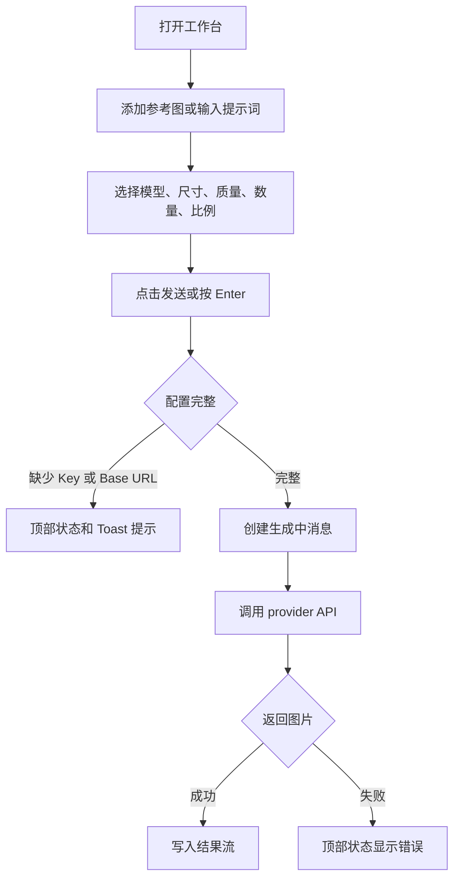

# Lightyear Banana 技术原型交互规格

版本：0.1  
日期：2026-04-28  
范围：当前 Photoshop UXP 技术原型的工作台、结果流、设置页和画布交互

## 交互目标

Lightyear Banana 的核心体验是把 Photoshop 画布变成生图工作流的上下文。用户从当前文档采集参考图，输入提示词，选择模型参数，生成图片，再把结果送回 Photoshop。

交互需要优先满足三点：

- 面板在 Photoshop docked 和 floating 状态下都能稳定操作。
- 每一步都能看到当前状态，尤其是生成、测试、置入和失败状态。
- UXP runtime 中优先使用稳定控件，后续 UI 控件必须收敛到 Spectrum UXP Widgets 或 SWC wrapper。

## 信息架构

| 区域 | 入口 | 主要任务 |
| --- | --- | --- |
| 顶部栏 | 面板顶部 | 显示页面标题、运行状态、主题切换、设置入口或返回 |
| 工作台 | 默认页面 | 查看生成历史、添加参考图、输入提示词、选择参数、发送请求 |
| 结果流 | 工作台中部 | 查看用户输入、参考图、生成耗时、结果图和结果操作 |
| 输入 Dock | 工作台底部 | 管理参考图、填写提示词、选择模型参数、发送 |
| 设置列表 | 设置入口 | 管理 Mock Server 和模型配置列表 |
| 配置详情 | 配置行或新建配置 | 编辑供应商、模型、Base URL、API Key 和启用状态 |

## 全局交互原则

### 面板布局

- 面板最小宽度按 280px 设计。
- 顶部栏固定在上方。
- 输入 Dock 固定在底部。
- 结果流占据中间剩余空间，内容过多时内部滚动。
- Toast 出现在输入区上方，不能遮挡发送按钮。

### 状态展示

状态文字统一显示在顶部栏右侧。

常见状态：

| 状态 | 触发 |
| --- | --- |
| `Photoshop UXP` | 面板在 UXP runtime 中启动 |
| `浏览器预览` | 面板在浏览器 fallback 中启动 |
| `Photoshop 已连接` | 刷新文档状态成功 |
| `已添加可见图层` | 添加可见图层参考图成功 |
| `已添加选区` | 添加选区参考图成功 |
| `已添加当前选中图层` | 添加当前选中图层参考图成功 |
| `请输入提示词或添加参考图` | 发送时没有提示词和参考图 |
| `请输入 API Key` | 真实 API 模式下缺少 Key |
| `请输入 Base URL` | 自定义 Base URL 配置缺少地址 |
| `生成完成` | 生图请求成功返回 |
| `浏览器预览无法置入 Photoshop` | 浏览器模式下点击置入 |
| `已置入全画布` | 结果写入全画布成功 |
| `已置入当前选区` | 结果写入当前选区成功 |
| `保存成功` | 配置保存成功 |

### 禁用态

- 生成请求进行中，参考图添加、发送按钮、配置测试等会进入不可用状态。
- 当前模型达到参考图上限后，添加参考按钮不可继续添加。
- Base URL 不支持自定义的供应商，Base URL 输入框禁用。
- 测试 API 进行中，测试按钮禁用。

### 反馈层级

| 层级 | 适用场景 | 当前表现 |
| --- | --- | --- |
| 顶部状态 | 持续性或全局状态 | 顶部栏文本 |
| Toast | 保存、启用、缺少关键配置 | 居中轻提示 |
| 行内状态 | 设置测试结果、配置状态 | 状态 Badge 或测试按钮文案 |
| 对话流状态 | 生成中 | Loading turn |
| 原生错误 | Photoshop API 或网络失败 | 转成顶部状态文本 |

## 页面和状态

### 工作台初始状态

进入面板后默认显示工作台。

首屏元素：

- 顶部栏标题 `Lightyear Banana v0.1`。
- 顶部栏状态为当前 runtime。
- 结果流空状态显示 `暂无生成结果`。
- 输入 Dock 显示 `参考图 0 / 当前模型上限`。
- 提示词输入框占位为 `输入提示词`。
- 参数区显示当前启用模型、尺寸、质量、数量、比例。
- 发送按钮在没有提示词和参考图时禁用。

### 设置列表状态

点击顶部设置按钮进入设置列表。

元素：

- 顶部标题为 `设置`。
- 顶部返回按钮回到工作台。
- Mock Server 卡片展示开关。
- Mock Server 开启后展示本地地址输入框和 Mock Keys。
- 配置列表展示配置名称、供应商、模型和可用状态。
- `新建配置` 按钮进入配置详情。
- 点击配置行进入配置详情。

### 配置详情状态

从配置列表点击配置行或新建配置进入详情。

元素：

- 顶部标题为 `配置详情` 或 `新建配置`。
- 顶部返回按钮回到配置列表。
- 表单包含启用开关、配置名称、供应商、模型、Base URL、API Key。
- Mock Server 开启后显示 Mock Keys 快捷按钮。
- 能力摘要展示参考图上限、尺寸、质量、数量、比例。
- 底部动作包含 `测试 API`、`保存`、`删除` 或 `取消`。

## 主流程

### 生成图片

交互规则：

- 提示词和参考图至少存在一项才允许发送。
- 有参考图但没有提示词时，发送内容使用 `根据参考图生成`。
- 发送后立即清空输入框和当前参考图。
- 发送后在结果流末尾追加生成中消息。
- 生成中消息展示已发送参考图、提示词和计时。
- 成功后生成中消息消失，结果消息进入结果流。
- 失败后生成中消息消失，错误进入顶部状态。

### 添加参考图

入口位于输入 Dock 的 `添加参考`。

菜单项：

| 菜单项 | Photoshop UXP 行为 | 浏览器预览行为 |
| --- | --- | --- |
| 可见图层 | 抓取当前文档可见合成图 | 使用 mock 图 |
| 选区 | 抓取当前选区合成图和 bounds | 使用 mock 图 |
| 当前选中图层 | 抓取 active layer 像素 | 使用 mock 图 |
| 上传文件 | 当前占位 | 使用 mock 图 |
| 剪贴板 | 当前占位 | 使用 mock 图 |

交互规则：

- 点击 `添加参考` 打开菜单，再次点击关闭。
- 点击外部区域关闭菜单。
- 选择来源后关闭菜单。
- 添加成功后参考图进入横向缩略图列表。
- 缩略图显示序号、来源标签和尺寸。
- 缩略图右上角删除按钮移除该参考图。
- 有参考图时显示 `清空`，点击后移除全部参考图。
- 达到模型参考图上限后，添加入口进入禁用态。

### 选择参数

参数控件位于输入 Dock。

控件：

| 控件 | 行为 |
| --- | --- |
| 模型 | 只展示启用配置 |
| 尺寸 | 跟随当前模型能力 |
| 质量 | 跟随当前模型能力 |
| 数量 | 跟随当前模型能力 |
| 比例 | 跟随当前模型能力 |

交互规则：

- 点击控件打开下拉菜单。
- 选择选项后关闭菜单。
- 点击控件外部关闭菜单。
- 切换模型后，尺寸默认取当前模型较高尺寸。
- 切换模型后，质量、数量、比例保留可用值；不可用时回退到当前模型默认值。

### 发送输入

触发方式：

- 点击 `发送`。
- 在提示词输入框按 Enter。

键盘规则：

- Shift + Enter 输入换行。
- 输入法组合状态下 Enter 不发送。
- 生成中 Enter 不发送。
- 发送条件不足时发送按钮禁用。

## 结果流交互

### 空状态

结果流没有历史记录且没有生成中任务时，显示 `暂无生成结果`。

### 用户消息

用户消息显示本轮发送的参考图和提示词。

规则：

- 有参考图时，参考图显示在提示词上方。
- 参考图缩略图使用小尺寸。
- 用户消息靠右展示。

### 生成中消息

生成开始后展示生成中消息。

内容：

- 已发送参考图。
- 已发送提示词。
- `正在生成中... Ns`。

规则：

- 每秒显示当前耗时。
- 使用 aria-live。
- 请求结束后移除。

### 结果消息

生成成功后展示结果消息。

内容：

- 耗时，如 `耗费 6s`。
- 响应文案，如 `{配置名称} 已生成 {数量} 张图`。
- 结果图片网格。

每张结果图动作：

| 动作 | 结果 |
| --- | --- |
| 置入 | 打开置入目标菜单 |
| 超分 | 把结果图填入下一轮超分参数 |
| 参考 | 把结果图加入当前参考图 |

### 置入菜单

点击结果图的 `置入` 打开目标菜单。

目标：

| 目标 | 出现条件 | 行为 |
| --- | --- | --- |
| 参考图片 N 的选区 | 本轮发送过选区参考图 | 置入到该参考图记录的 bounds |
| 全画布 | 始终显示 | 缩放到当前文档尺寸后置入 |
| 当前选区 | 始终显示 | 读取当前 Photoshop 选区后置入 |

交互规则：

- 点击 `置入` 切换菜单展开或关闭。
- 点击结果流其他区域关闭菜单。
- 选择目标后关闭菜单。
- 浏览器预览中点击置入不写入 Photoshop，并显示状态。

### 超分

点击 `超分` 后工作台进入下一轮准备状态。

变化：

- 当前模型切换为该结果所属模型配置。
- 当前参考图替换为该结果图。
- 提示词填入 `提升分辨率`。
- 数量设为 1。
- 尺寸选当前模型支持的高分辨率选项。
- 质量选当前模型支持的最高质量选项。
- 比例优先使用 `原图比例`。
- 顶部状态显示该图已填入超分参数。

### 参考

点击 `参考` 后把该结果图加入输入 Dock 的参考图列表。

规则：

- 该参考图来源为 `generated`。
- 受当前模型参考图上限限制。
- 添加成功后顶部状态更新。

## 设置交互

### Mock Server

Mock Server 位于设置列表顶部。

关闭状态：

- 显示 `发送到真实 API`。
- 生成请求走真实 provider。
- 配置测试在当前原型中使用短等待和 key 文本规则。

开启状态：

- 显示 `本地端口已启用`。
- 展示本地地址输入框。
- 展示 Mock Keys。
- 生成请求和测试请求走本地 mock endpoint。
- 没有 API Key 时默认使用 `mock-good`。

### 配置状态

配置列表每行展示状态。

| 状态 | 条件 |
| --- | --- |
| 启用 | 配置启用且关键字段满足当前模式 |
| 未启用 | 配置开关关闭 |
| API 不可用 | 真实 API 模式下缺少 API Key、缺少 Base URL，或 key/url 命中失败文本规则 |

### 新建配置

点击 `新建配置` 进入详情页。

默认值：

- 名称为 `新配置`。
- Provider 为 OpenAI compatible。
- 模型为 `custom-image-model`。
- API Key 为空。
- Base URL 为空。
- 启用状态为开启。

保存后：

- 新配置进入配置列表。
- 可在工作台模型选择器中选择。
- 顶部状态显示保存成功。

取消：

- 新建未保存时，底部动作显示 `取消`。
- 点击后回到配置列表。

### 编辑配置

编辑字段：

- 配置启用。
- 配置名称。
- 供应商。
- 模型。
- Base URL。
- API Key。

交互规则：

- 供应商改变后，模型重置为该供应商默认模型。
- 供应商不支持 Base URL 时，Base URL 清空并禁用输入。
- 开启配置后，该配置成为当前激活配置。
- 关闭当前激活配置后，系统选择下一个启用配置。
- 删除配置后回到配置列表。
- 至少保留一个配置。

### 测试 API

点击 `测试 API` 后进入测试状态。

状态：

| 状态 | 按钮文案 |
| --- | --- |
| idle | 测试 API |
| testing | 测试中 |
| success | API 可用 |
| error 缺少 API Key | 缺少 Key |
| error 缺少 Base URL | 缺少 Base URL |
| error 其他 | API 不可用 |

规则：

- 测试中按钮禁用。
- 缺少关键字段时不发起请求。
- Mock Server 开启时发起本地测试请求。
- 测试失败时顶部状态同步显示错误。

## 浏览器预览交互

浏览器预览用于 UI 开发和 mock 状态验证。

差异：

- 面板状态显示 `浏览器预览`。
- 可见图层、选区、当前选中图层返回 mock 图。
- 上传文件和剪贴板返回 mock 图。
- 置入 Photoshop 时只显示状态，不执行写入。
- 其余工作台和设置交互保持一致。

## Photoshop UXP 交互

### 画布采集

| 操作 | 用户入口 | 成功结果 | 失败场景 |
| --- | --- | --- | --- |
| 抓取可见图层 | 添加参考 > 可见图层 | 参考图进入输入 Dock | 没有打开文档 |
| 抓取选区 | 添加参考 > 选区 | 参考图带 sourceBounds | 没有有效选区 |
| 抓取选中图层 | 添加参考 > 当前选中图层 | 参考图进入输入 Dock | 没有 active layer |

失败时不新增参考图，顶部状态显示错误。

### 结果写入

| 操作 | 用户入口 | 行为 |
| --- | --- | --- |
| 写入全画布 | 结果图 > 置入 > 全画布 | 读取文档尺寸，缩放结果图并创建像素图层 |
| 写入当前选区 | 结果图 > 置入 > 当前选区 | 读取当前选区 bounds，缩放结果图并创建像素图层 |
| 写入参考选区 | 结果图 > 置入 > 参考图片 N 的选区 | 使用本轮参考图记录的 bounds 创建像素图层 |

UXP 规则：

- 所有修改 Photoshop 文档状态的操作必须进入 `executeAsModal()`。
- 图像写入使用 `imaging.putPixels()`。
- 当前只处理 8-bit 图像。
- 插入完成后释放临时 imageData。

## 错误和边界状态

| 场景 | 交互要求 |
| --- | --- |
| 没有提示词和参考图 | 发送按钮禁用；强行触发时提示 `请输入提示词或添加参考图` |
| 缺少 API Key | 不发起生成；顶部状态和 Toast 提示 |
| 缺少 Base URL | 不发起生成；顶部状态和 Toast 提示 |
| 达到参考图上限 | 添加入口禁用；状态提示当前模型最多 N 张参考图 |
| 没有 Photoshop 文档 | 采集或置入失败，顶部状态显示错误 |
| 没有有效选区 | 选区采集或当前选区置入失败，顶部状态显示错误 |
| 网络失败 | 生成中状态结束，顶部状态显示错误 |
| API 没有返回图片 | 生成中状态结束，顶部状态显示 `API 未返回图片` |
| 设置保存失败 | 当前实现不阻断流程，后续需要补充持久化失败提示 |

## 文案规范

面向用户的文案要短，直接说明可执行对象或当前状态。

推荐：

| 类型 | 文案 |
| --- | --- |
| 页面标题 | `Lightyear Banana v0.1`、`设置`、`配置详情` |
| 空状态 | `暂无生成结果` |
| 输入占位 | `输入提示词` |
| 操作 | `添加参考`、`清空`、`发送`、`置入`、`超分`、`参考` |
| 状态 | `生成完成`、`保存成功`、`API 配置可用` |

避免：

- 把实现说明放进 UI。
- 把调研过程、源码来源、技术判断写成用户可见文案。
- 使用长段解释替代明确状态。

## UXP UI 强制约束

后续交互实现必须遵守 `ref/uxp-ui-runtime-rules.md`。

关键约束：

- 表单控件、按钮、选择器、开关、菜单优先使用 Spectrum UXP Widgets 或 SWC wrapper。
- 普通 HTML 只能承担外层布局、文本容器和经过实机验证的简单结构。
- CSS Grid、transition、animation、filter、backdrop-filter、复杂选择器需要逐项验证。
- 不依赖浏览器专有交互能力。
- 面板内的所有关键路径必须在 UXP Developer Tools reload 后实测。

## 待补交互

| 能力 | 需要补充的交互 |
| --- | --- |
| 上传文件 | 文件选择、格式限制、尺寸提示、读取失败反馈 |
| 剪贴板 | 剪贴板权限、空剪贴板、非图片内容反馈 |
| 安全存储 | API Key 保存成功、迁移提示、读取失败反馈 |
| Provider 错误 | 认证失败、额度不足、限流、服务错误的分级文案 |
| 结果管理 | 删除历史、复制图片、打开大图预览 |
| Photoshop 图层 | 结果图层命名、分组、覆盖策略 |
| 长任务 | 取消生成、重试、超时后恢复输入 |

## 回归清单

- 首次打开面板显示工作台和空状态。
- 顶部设置按钮进入设置列表。
- 设置返回按钮回到工作台。
- 新建配置、保存、取消、删除路径可用。
- Mock Server 开关会影响测试和生成请求。
- 添加参考菜单可打开、选择和关闭。
- 参考图可删除和清空。
- Enter 发送，Shift + Enter 换行。
- 发送后出现生成中消息。
- 成功后结果流自动滚动到底部。
- 置入菜单可打开、关闭和选择目标。
- 超分会填入下一轮参数。
- 参考会把结果图加入输入 Dock。
- 浏览器预览中置入不会调用 Photoshop。
- UXP 中可见图层、选区、选中图层采集可用。
- UXP 中全画布和当前选区置入可用。
