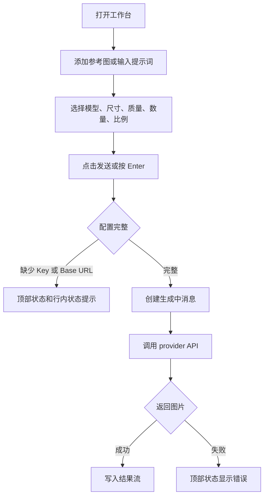

# Mugen vNext 交互规格

版本：vNext
日期：2026-08-11
范围：浏览器与 Photoshop CCX 双运行时的工作台、结果流、设置页

## 交互目标

Mugen 的核心体验是围绕参考图、提示词、模型参数和生成结果持续创作。在 Photoshop CCX 中，画布可以直接成为上下文，结果也可以送回当前文档；在普通浏览器中，用户保留完整网络与配置流程，不看到 Photoshop 专属操作。

交互需要优先满足三点：

- 工作台在普通浏览器以及 Photoshop docked 和 floating 状态下都能稳定操作。
- 每一步都能看到当前状态，尤其是生成、测试、置入和失败状态。
- 两种运行时共享同一 WebUI 组件与行为；运行时差异由能力合同处理。

## 信息架构

| 区域 | 入口 | 主要任务 |
| --- | --- | --- |
| 顶部栏 | 面板顶部 | 显示页面标题、运行状态、主题切换、设置入口或返回 |
| 工作台 | 默认页面 | 查看生成历史、添加参考图、输入提示词、选择参数、发送请求 |
| 结果流 | 工作台中部 | 查看用户输入、参考图、生成耗时、结果图和结果操作 |
| 输入 Dock | 工作台底部 | 管理参考图、填写提示词、选择模型参数、发送 |
| 设置列表 | 设置入口 | 管理模型配置、主题和预设；测试环境可接入 APIMart 本地配置 |
| 配置详情 | 配置行或新建配置 | 编辑供应商、模型、Base URL、API Key 和启用状态 |
| 预设提示词 | 设置列表 > 管理 | 新增、编辑和删除预设提示词 |

## 全局交互原则

### 面板布局

- 面板最小宽度按 260px 设计。
- 顶部栏固定在上方。
- 输入 Dock 固定在底部。
- 结果流占据中间剩余空间，内容过多时内部滚动。
- 短时操作结果显示在输入区上方的行内状态条，不遮挡发送按钮。

### 状态展示

状态文字统一显示在顶部栏右侧。

常见状态：

| 状态 | 触发 |
| --- | --- |
| `Photoshop` | 工作台在 CCX 中连接 Photoshop Host |
| `浏览器` | 工作台以独立浏览器运行时启动 |
| `Photoshop 已连接` | 刷新文档状态成功 |
| `已添加可见图层` | 添加可见图层参考图成功 |
| `已添加选区` | 添加选区参考图成功 |
| `已添加当前选中图层` | 添加当前选中图层参考图成功 |
| `请输入提示词或添加参考图` | 发送时没有提示词和参考图 |
| `请输入 API Key` | 真实 API 模式下缺少 Key |
| `请输入 Base URL` | 自定义 Base URL 配置缺少地址 |
| `生成完成` | 生图请求成功返回 |
| `已置入全画布` | 结果写入全画布成功 |
| `已置入当前选区` | 结果写入当前选区成功 |
| `保存成功` | 配置保存成功 |

### 禁用态

- 生成请求进行中，参考图添加、发送按钮、配置测试等会进入不可用状态。
- 当前模型达到参考图上限后，添加参考按钮不可继续添加。
- Base URL 不支持自定义的供应商，Base URL 输入框禁用。
- 测试 API 进行中，测试按钮禁用。

### 反馈层级

| 层级 | 适用场景 | 当前表现 |
| --- | --- | --- |
| 顶部状态 | 持续性或全局状态 | 顶部栏文本 |
| 行内操作状态 | 保存、启用、缺少关键配置 | 输入区上方的 `[STATUS]` 文本 |
| 行内状态 | 设置测试结果、配置状态 | 状态 Badge 或测试按钮文案 |
| 对话流状态 | 生成中 | Loading turn |
| 原生错误 | Photoshop API 或网络失败 | 转成顶部状态文本 |

## 页面和状态

### 工作台初始状态

进入面板后默认显示工作台。

首屏元素：

- 顶部栏标题 `Mugen`。
- 顶部栏状态为当前 runtime。
- 结果流空状态在 CCX 中可以提示从 Photoshop 添加参考图，在浏览器中只提示输入提示词或添加浏览器可访问的参考图。
- 输入 Dock 显示 `参考图 0 / 当前模型上限`。
- 提示词输入框占位为 `输入提示词，或输入 / 调用预设`。
- 参数区显示当前启用模型、尺寸、质量、数量、比例。
- 发送按钮在没有提示词和参考图时禁用。

### 设置列表状态

点击顶部设置按钮进入设置列表。

元素：

- 顶部标题为 `设置`。
- 顶部返回按钮回到工作台。
- 配置列表展示配置名称、供应商、模型和可用状态。
- 本地 APIMart 夹具通过普通 Provider 配置的 Base URL 和测试 Key 接入，不作为生产默认状态。
- `新建配置` 按钮进入配置详情。
- 点击配置行进入配置详情。

### 配置详情状态

从配置列表点击配置行或新建配置进入详情。

元素：

- 顶部标题为 `配置详情` 或 `新建配置`。
- 顶部返回按钮回到配置列表。
- 表单包含启用开关、配置名称、供应商、模型、Base URL、API Key。
- 能力摘要展示参考图上限、尺寸、质量、数量、比例。
- 底部动作包含 `测试 API`、`保存`、`删除` 或 `取消`。

## 主流程

### 生成图片

交互规则：

- 提示词和参考图至少存在一项才允许发送。
- 有参考图但没有提示词时，发送内容使用 `根据参考图生成`。
- 发送后立即清空输入框和当前参考图。
- 发送后在结果流末尾追加生成中消息。
- 生成中消息展示已发送参考图、提示词和计时。
- 成功后生成中消息消失，结果消息进入结果流。
- 失败后生成中消息消失，错误进入顶部状态。

### 添加参考图

入口位于输入 Dock 的 `添加参考`。

菜单项：

| 菜单项 | Photoshop CCX 行为 | 普通浏览器行为 |
| --- | --- | --- |
| 可见图层 | 抓取当前文档可见合成图 | 不渲染该入口 |
| 选区 | 抓取当前选区内所有可见图层的合成图和 bounds | 不渲染该入口 |
| 当前选中图层 | 抓取 active layer 像素 | 不渲染该入口 |
| 上传文件 | 按 CCX Host 文件能力适配 | 使用浏览器文件能力 |

交互规则：

- 点击 `添加参考` 打开菜单，再次点击关闭。
- 点击外部区域关闭菜单。
- 选择来源后关闭菜单。
- 输入框聚焦时，Ctrl/Cmd+V 可添加剪贴板图片；普通文本保持文本粘贴行为。
- 剪贴板仅提供 HTML 或图片 URL 时尝试导入对应图片；无法读取时显示 `无法读取剪贴板图片，请重新复制图片或保存后拖入`，图片地址不写入提示词。
- 图片文件可拖入工作台添加，粘贴和拖入都不调用宿主剪贴板读取。
- 添加成功后参考图进入横向缩略图列表。
- 选区参考图读取所有可见图层在当前选区内的合成结果，和当前选中图层无关。
- 缩略图显示序号、来源标签和尺寸。
- 缩略图右上角删除按钮移除该参考图。
- 有参考图时显示 `清空`，点击后移除全部参考图。
- 达到模型参考图上限后，添加入口进入禁用态。

### 选择参数

参数控件位于输入 Dock。

控件：

| 控件 | 行为 |
| --- | --- |
| 模型 | 只展示启用配置 |
| 尺寸 | 跟随当前模型能力 |
| 质量 | 跟随当前模型能力 |
| 数量 | 跟随当前模型能力 |
| 比例 | 跟随当前模型能力 |

交互规则：

- 点击控件打开下拉菜单。
- 选择选项后关闭菜单。
- 点击控件外部关闭菜单。
- 切换模型后，尺寸默认取当前模型较高尺寸。
- 切换模型后，质量、数量、比例保留可用值；不可用时回退到当前模型默认值。
- 图生图选择 `原图比例` 时，以参考图 1 的宽高为比例来源。输入比例可识别为 Gemini 支持的比例枚举时，APIMart Gemini 3.1 / 3 Pro 明确发送 `size`，Google Gemini 明确发送 `aspectRatio`；无法映射到支持枚举时，APIMart Gemini 发送 `size: "auto"`，Google Gemini 由模型按输入图决定输出比例。
- 用户明确选择固定比例时，继续发送该模型支持的固定比例，不使用自动跟随。

### 发送输入

触发方式：

- 点击 `发送`。
- 在提示词输入框按 Enter。

键盘规则：

- Shift + Enter 输入换行。
- 输入法组合状态下 Enter 不发送。
- 生成中 Enter 不发送。
- 发送条件不足时发送按钮禁用。
- CCX 所在的 Photoshop 窗口恢复激活后，提示词输入框在失活前处于编辑状态时恢复键盘输入；失活前焦点位于其他控件时不抢占焦点。

## 结果流交互

### 空状态

结果流没有历史记录且没有生成中任务时，显示 `暂无生成结果`。

### 用户消息

用户消息显示本轮发送的参考图和提示词。

规则：

- 有参考图时，参考图显示在提示词上方。
- 参考图缩略图使用小尺寸。
- 用户消息靠右展示。

### 生成中消息

生成开始后展示生成中消息。

内容：

- 已发送参考图。
- 已发送提示词。
- `正在生成中... Ns`。

规则：

- 每秒显示当前耗时。
- 使用 aria-live。
- 请求结束后移除。

### 结果消息

生成成功后展示结果消息。

内容：

- 耗时，如 `耗费 6s`。
- 响应文案，如 `{配置名称} 已生成 {数量} 张图`。
- 结果图片网格。

每张结果图动作：

| 动作 | 结果 |
| --- | --- |
| 置入 | 仅在 CCX 中出现，打开置入目标菜单 |
| 超分 | 把结果图填入下一轮超分参数 |
| 参考 | 把结果图加入当前参考图 |

### 置入菜单

在 Photoshop CCX 中，点击结果图的 `置入` 打开目标菜单。普通浏览器不渲染按钮、菜单、快捷键或无障碍节点。

目标：

| 目标 | 出现条件 | 行为 |
| --- | --- | --- |
| 参考图片 N 的选区 | 本轮发送过选区参考图 | 置入到该参考图记录的 bounds |
| 全画布 | CCX 已连接 | 缩放到当前文档尺寸后置入 |
| 当前选区 | CCX 已连接 | 读取当前 Photoshop 选区后置入 |

交互规则：

- 点击 `置入` 切换菜单展开或关闭。
- 点击结果流其他区域关闭菜单。
- 选择目标后关闭菜单。

### 超分

点击 `超分` 后工作台进入下一轮准备状态。

变化：

- 当前模型切换为该结果所属模型配置。
- 当前参考图替换为该结果图。
- 提示词填入 `提升分辨率`。
- 数量设为 1。
- 尺寸选当前模型支持的高分辨率选项。
- 质量选当前模型支持的最高质量选项。
- 比例优先使用 `原图比例`。
- 顶部状态显示该图已填入超分参数。

### 参考

点击 `参考` 后把该结果图加入输入 Dock 的参考图列表。

规则：

- 该参考图来源为 `generated`。
- 受当前模型参考图上限限制。
- 添加成功后顶部状态更新。

## 设置交互

### 主题

主题菜单位于顶部栏。

- 界面支持 `Nothing` 和 `经典`。
- 模式支持 `跟随系统`、`深色`、`浅色`。
- 点击菜单外区域关闭菜单。
- Nothing 默认使用深色，并保留用户选择。
- Nothing 深色使用 OLED 黑，浅色使用暖白，不使用渐变、阴影和动效。
- 切换 Nothing 与经典主题时，控件尺寸、页面间距和响应式布局保持一致。

### 预设提示词

设置列表显示预设数量，点击 `管理` 进入预设页。

- 支持新增、编辑和删除，最多 100 条。
- 名称长度为 1–24 个字符，只支持中文、英文字母、数字、`_`、`-`。
- 重名和非法名称显示行内错误。
- 输入 `/` 或 `/名称片段` 打开联想菜单。
- 方向键移动选择，Enter 展开，Escape 关闭。
- 点击外部区域关闭菜单。
- 输入精确 `/名称` 后发送也会展开预设。
- `//正文` 发送字面量 `/正文`。
- 未知精确命令保留输入和参考图，并显示错误。
- `/名称 其他内容` 按普通正文发送。
- 预设正文只展开一次。

### APIMart 本地测试配置

APIMart 夹具通过普通 Provider 配置接入。用户填写 loopback Base URL 和测试 Key，随后使用与真实配置相同的测试、保存和生成流程。

规则：

- 生产首次启动不自动创建或启用测试配置。
- 配置测试必须发出真实 HTTP 请求，不能按 Key 文本在客户端模拟成功。
- 成功结果固定显示同一张小猫 fixture。
- 关闭或删除该配置后，其他 Provider 不受影响。
- 测试 Key、请求记录和状态重置接口只服务本地验证。

### 配置状态

配置列表每行展示状态。

| 状态 | 条件 |
| --- | --- |
| 启用 | 配置启用且关键字段满足当前模式 |
| 未启用 | 配置开关关闭 |
| API 不可用 | 真实 API 模式下缺少 API Key、缺少 Base URL，或 key/url 命中失败文本规则 |

### 新建配置

点击 `新建配置` 进入详情页。

默认值：

- 名称为 `新配置`。
- Provider 为 OpenAI compatible。
- 模型为 `custom-image-model`。
- API Key 为空。
- Base URL 为空。
- 启用状态为开启。

保存后：

- 新配置进入配置列表。
- 可在工作台模型选择器中选择。
- 顶部状态显示保存成功。

取消：

- 新建未保存时，底部动作显示 `取消`。
- 点击后回到配置列表。

### 编辑配置

编辑字段：

- 配置启用。
- 配置名称。
- 供应商。
- 模型。
- Base URL。
- API Key。

交互规则：

- 供应商改变后，模型重置为该供应商默认模型。
- 供应商不支持 Base URL 时，Base URL 清空并禁用输入。
- 开启配置后，该配置成为当前激活配置。
- 关闭当前激活配置后，系统选择下一个启用配置。
- 删除配置后回到配置列表。
- 至少保留一个配置。

### 测试 API

点击 `测试 API` 后进入测试状态。

状态：

| 状态 | 按钮文案 |
| --- | --- |
| idle | 测试 API |
| testing | 测试中 |
| success | API 可用 |
| error 缺少 API Key | 缺少 Key |
| error 缺少 Base URL | 缺少 Base URL |
| error 其他 | API 不可用 |

规则：

- 测试中按钮禁用。
- 缺少关键字段时不发起请求。
- APIMart 本地配置发起真实 loopback 测试请求；其他配置发往用户填写的 Provider。
- 测试失败时顶部状态同步显示错误。

## 浏览器独立运行交互

浏览器运行时提供完整配置、网络生成和结果流程，不依赖 CCX 或 Mock Host。

差异：

- 面板状态显示 `浏览器`。
- 可见画布、选区和当前图层入口不渲染。
- 上传文件、快捷键粘贴和拖入图片使用浏览器允许的能力。
- 结果卡片不渲染 Photoshop 置入入口。
- 设置、Provider 测试、真实请求、轮询、取消、历史、参考和超分保持可用。
- 浏览器不会产生 mock 画布或调用 CCX Host。

## Photoshop CCX 交互

### 画布采集

| 操作 | 用户入口 | 成功结果 | 失败场景 |
| --- | --- | --- | --- |
| 抓取可见图层 | 添加参考 > 可见图层 | 参考图进入输入 Dock | 没有打开文档 |
| 抓取选区 | 添加参考 > 选区 | 参考图带 sourceBounds | 没有有效选区 |
| 抓取选中图层 | 添加参考 > 当前选中图层 | 参考图进入输入 Dock | 没有 active layer |

失败时不新增参考图，顶部状态显示错误。

### 结果写入

| 操作 | 用户入口 | 行为 |
| --- | --- | --- |
| 写入全画布 | 结果图 > 置入 > 全画布 | 读取文档尺寸，缩放结果图并创建像素图层 |
| 写入当前选区 | 结果图 > 置入 > 当前选区 | 读取当前选区 bounds，缩放结果图并创建像素图层 |
| 写入参考选区 | 结果图 > 置入 > 参考图片 N 的选区 | 使用本轮参考图记录的 bounds 创建像素图层 |

CCX Host 规则：

- 所有修改 Photoshop 文档状态的操作必须进入 `executeAsModal()`。
- 图像写入使用 `imaging.putPixels()`。
- 当前只处理 8-bit 图像。
- 插入完成后释放临时 imageData。

## 错误和边界状态

| 场景 | 交互要求 |
| --- | --- |
| 没有提示词和参考图 | 发送按钮禁用；强行触发时提示 `请输入提示词或添加参考图` |
| 缺少 API Key | 不发起生成；顶部状态和行内状态提示 |
| 缺少 Base URL | 不发起生成；顶部状态和行内状态提示 |
| 未知预设命令 | 不发起生成；保留输入和参考图，显示 `未找到预设“名称”` |
| 达到参考图上限 | 添加入口禁用；状态提示当前模型最多 N 张参考图 |
| 没有 Photoshop 文档 | 采集或置入失败，顶部状态显示错误 |
| 没有有效选区 | 选区采集或当前选区置入失败，顶部状态显示错误 |
| 网络失败 | 生成中状态结束，顶部状态显示错误 |
| API 没有返回图片 | 生成中状态结束，顶部状态显示 `API 未返回图片` |
| 设置保存失败 | 当前实现不阻断流程，后续需要补充持久化失败提示 |

## 文案规范

面向用户的文案要短，直接说明可执行对象或当前状态。

推荐：

| 类型 | 文案 |
| --- | --- |
| 页面标题 | `Mugen`、`设置`、`配置详情` |
| 空状态 | `READY`；CCX 可提示从 Photoshop 添加参考图，浏览器不提 Photoshop |
| 输入占位 | `输入提示词，或输入 / 调用预设` |
| 操作 | `添加参考`、`清空`、`发送`、`置入`、`超分`、`参考` |
| 状态 | `生成完成`、`保存成功`、`API 配置可用` |

避免：

- 把实现说明放进 UI。
- 把调研过程、源码来源、技术判断写成用户可见文案。
- 使用长段解释替代明确状态。

## CCX 与 WebUI 约束

CCX Host 壳遵守 `docs/ref/ccx-adobe-runtime-rules.md`，CCX WebView 固定加载正式云端 WebUI，与普通浏览器共同使用同一部署页面的组件与样式。

关键约束：

- CCX Host 壳的原生控件优先使用 Adobe Spectrum UXP Widgets 或 SWC wrapper。
- WebUI 组件为唯一工作台实现，不为 CCX 另写第二套 Spectrum 工作台。
- WebUI 的 CSS、输入、文件和网络能力需要同时在普通浏览器与 Photoshop WebView 验证。
- Photoshop 专属命令只通过 Host adapter 暴露。
- 面板内关键路径在 Adobe UXP Developer Tools Reload 后实测。

## 待补交互

| 能力 | 需要补充的交互 |
| --- | --- |
| 上传文件 | 文件选择、格式限制、尺寸提示、读取失败反馈 |
| 粘贴图片 | Ctrl/Cmd+V、HTML/URL 图片、空内容和不可读图片反馈 |
| 安全存储 | API Key 保存成功、迁移提示、读取失败反馈 |
| Provider 错误 | 认证失败、额度不足、限流、服务错误的分级文案 |
| 结果管理 | 删除历史、复制图片、打开大图预览 |
| Photoshop 图层 | 结果图层命名、分组、覆盖策略 |
| 长任务 | 取消生成、重试、超时后恢复输入 |

## 回归清单

- 首次打开面板显示工作台和空状态。
- 顶部设置按钮进入设置列表。
- 设置返回按钮回到工作台。
- 新建配置、保存、取消、删除路径可用。
- APIMart loopback 配置可以测试、保存并发起真实请求。
- 添加参考菜单可打开、选择和关闭。
- 参考图可删除和清空。
- Enter 发送，Shift + Enter 换行。
- `/名称` 的菜单选择、键盘选择、直接发送和 `//` 转义可用。
- 预设新增、编辑、删除、重名校验和重载恢复可用。
- Nothing 深色、浅色和 260px 宽度可用。
- 发送后出现生成中消息。
- 成功后结果流自动滚动到底部。
- CCX 中置入菜单可打开、关闭和选择目标。
- 超分会填入下一轮参数。
- 参考会把结果图加入输入 Dock。
- 浏览器中 Photoshop 抓取与置入入口完全不存在。
- 浏览器中配置、网络生成、固定小猫结果与错误恢复可用。
- CCX 中可见图层、选区、选中图层采集可用。
- CCX 中全画布和当前选区置入可用。
- 真实 Photoshop 完成抓取、APIMart 请求、固定小猫获取和置入闭环。
